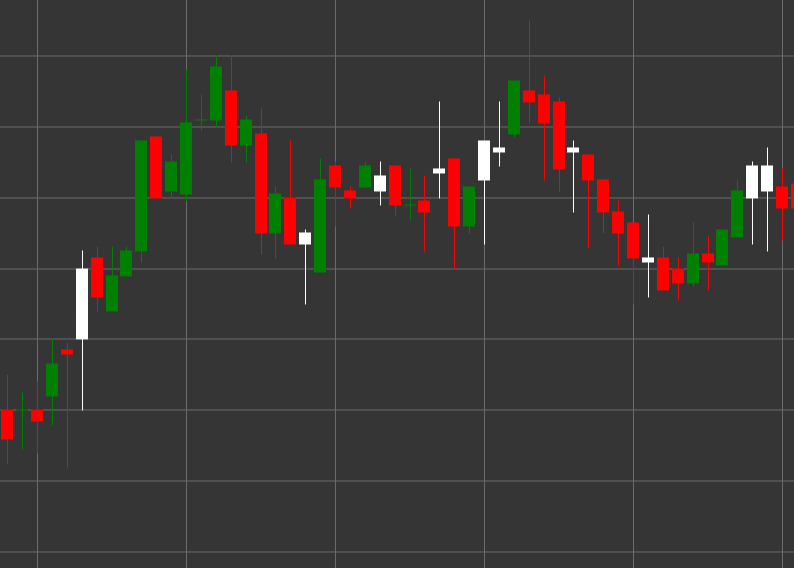

# Pattern Bullish Candle

Bullish Candle is a candlestick pattern characterized by a closing price higher than the opening price. This pattern shows a bullish market sentiment.

##### Key Features:

- Opening price is lower than closing price (O < C).
- Indicates bullish pressure in the market.

### Interpretation

The Bullish Candle signals a bullish market sentiment with several characteristics:

- A long lower shadow indicates that sellers tried to push the price down, but buyers took control.
- Closing above the opening shows the predominance of buyers at the end of the period.
- The ratio between the candle body and the lower shadow demonstrates the strength of buyers after testing lower levels.
- In a downtrend, it may signal a potential reversal.
- In an uptrend, it confirms the strength of the trend, especially after a correction.

### Trading Strategies

Bullish Candle can be used in various trading strategies:

- Enter a long position after the formation of a Bullish Candle at a support level or in an oversold zone.
- Set a stop-loss below the minimum of the candle to protect against further decline.
- Combine with other technical indicators or patterns to increase the probability of a successful trade.
- Use to confirm uptrend signals from indicators such as MACD or Moving Averages.
- Pay attention to trading volume - high volume enhances the significance of the signal.

## See also

[Pattern Bearish Candle](bearish.md)

[Pattern White Candle](white_candle.md)