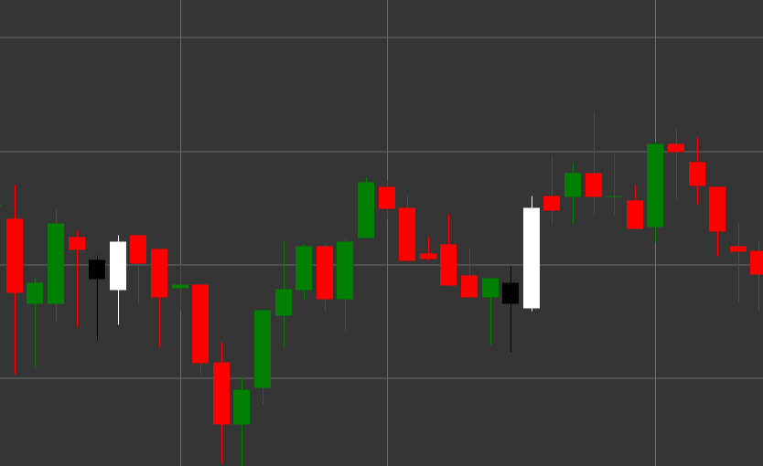

# Pattern Bullish Engulfing

Bullish Engulfing is a powerful bullish reversal candlestick pattern consisting of two candles that forms in a downtrend. The first candle is black (bearish), followed by a white (bullish) candle, the body of which completely engulfs (covers) the body of the previous candle.

##### Key Features:

- First candle is black with opening price higher than closing price (O > C).
- Second candle is white with opening price lower than closing price (O < C).
- Opening price of the second candle is lower than the closing price of the first candle (O < pC).
- Closing price of the second candle is higher than the opening price of the first candle (C > pO).
- The body of the second candle completely engulfs the body of the first candle.
- Forms in a downtrend.

### Interpretation

Bullish Engulfing is considered one of the most reliable signals of a downtrend reversal:

- The first candle confirms the existing downtrend and shows control by sellers.
- The second candle demonstrates a sharp transition of control to buyers, who not only reverse the losses of the previous period but also create a significant gain.
- The complete engulfing of the previous candle body symbolizes a complete shift in prevailing sentiment from bearish to bullish.
- The larger the size of the second candle compared to the first, the stronger the signal.
- If the pattern forms at a support level or after a prolonged downtrend, its significance increases.

### Trading Strategies

Bullish Engulfing provides excellent opportunities for entering a long position:

- Enter a long position after the pattern formation, usually at the opening of the next candle.
- Place a stop-loss below the low of the second candle of the pattern.
- Target profit can be set based on previous resistance levels, risk/reward ratio, or using technical indicators.
- High trading volume during the formation of the second candle significantly increases the reliability of the signal.
- Combine with other indicators, such as RSI in the oversold zone or moving average convergence, to increase the probability of a successful trade.

## See also

[Pattern Bearish Engulfing](bearish_engulfing.md)

[Pattern Piercing](piercing.md)