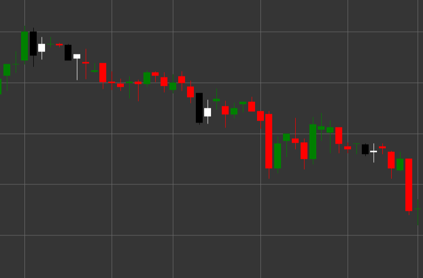

# Pattern Bullish Harami

Bullish Harami is a reversal candlestick pattern consisting of two candles that forms in a downtrend. The term "harami" comes from the Japanese word meaning "pregnancy," as the small candle (child) is contained within the large candle (mother).

##### Key Features:

- First candle is black (bearish) with opening price higher than closing price (O > C) and a long body.
- Second candle is white (bullish) with opening price lower than closing price (O < C) and a smaller body.
- The body of the second candle is completely contained within the body of the first candle (O > pC) and (C < pO).
- Forms in a downtrend.

### Interpretation

Bullish Harami signals a potential end to a downtrend:

- The first candle confirms the existing downtrend and the strength of sellers.
- The second candle, completely contained within the first, indicates a loss of bearish momentum and possible emergence of buyers.
- The smaller the body of the second candle compared to the first, the more pronounced the uncertainty and potential for reversal.
- If the second candle is a doji (with a very small body), the pattern is called a "Harami Cross" and is considered a stronger signal of uncertainty.
- This pattern is often considered a weaker signal compared to Bullish Engulfing, but may be an earlier indicator of a possible reversal.

### Trading Strategies

Bullish Harami typically requires additional confirmation for position entry:

- Wait for a confirming bullish candle after the pattern formation before entering a long position.
- Place a stop-loss below the low of the pattern or the low of the first candle.
- Use trading volume as additional confirmation - decreasing volume on the second candle and increasing on subsequent bullish candles strengthens the signal.
- Combine with other technical indicators, such as RSI in the oversold zone or oscillator divergence.
- Consider the pattern at support levels or in oversold zones to increase the probability of a successful trade.
- Possible use for closing existing short positions, even if the signal is not strong enough to open long positions.

## See also

[Pattern Bearish Harami](bearish_harami.md)

[Pattern Bullish Engulfing](bullish_engulfing.md)