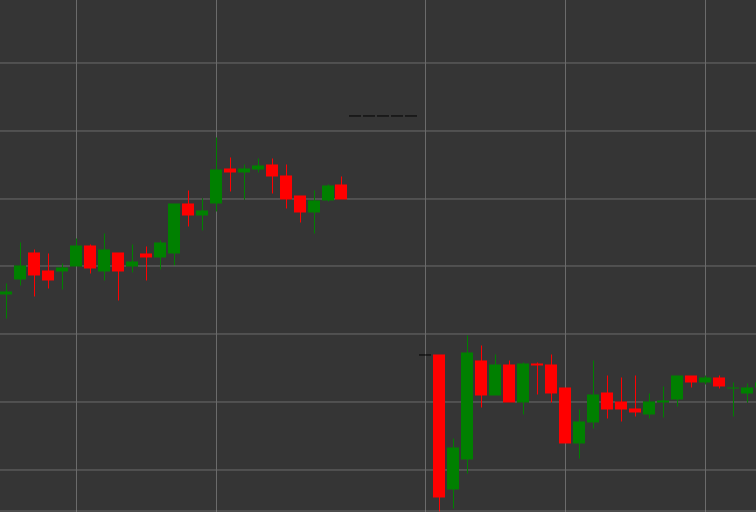

# Pattern Dragonfly

Dragonfly is a candlestick pattern characterized by equal opening and closing prices, no upper shadow, and a long lower shadow. The candle resembles the shape of the letter "T," which gave it the name "dragonfly."

##### Key Features:

- Opening price equals closing price (O == C).
- No upper shadow (TS == 0).
- Long lower shadow.
- Similar to a Hammer, but with a neutral body (doji).

### Interpretation

Dragonfly Doji is considered a potential reversal signal, especially in a downtrend:

- The long lower shadow indicates that sellers controlled the market for most of the period, but then buyers returned the price to the opening level.
- The rejection of lower prices may signal the end of bearish pressure.
- Unlike a regular Hammer, the equality of opening and closing prices (doji) indicates a more pronounced balance of power.
- In a downtrend, this pattern has bullish implications and may foreshadow a reversal.
- In an uptrend, it may signal a potential correction.

### Trading Strategies

Dragonfly requires additional confirmation for making trading decisions:

- Wait for a confirming bullish candle in the next period before entering a long position.
- Place a stop-loss below the minimum of the Dragonfly.
- Use in conjunction with support levels or oversold conditions on indicators.
- Pay attention to volume - high volume during the formation of a Dragonfly increases the credibility of the signal.
- Possible use for determining an exit point from short positions, even without entering a long position.

## See also

[Pattern Gravestone](gravestone.md)

[Pattern Hammer](hammer.md)