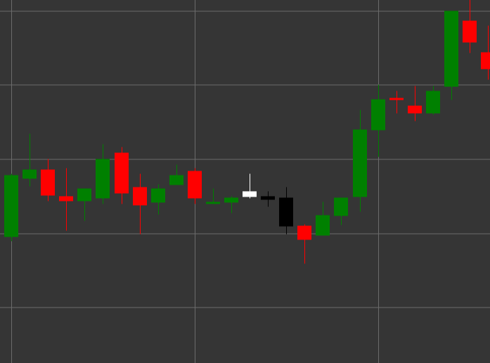

# Pattern Evening Star

Evening Star is a bearish reversal candlestick pattern consisting of three candles that forms in an uptrend. This pattern shows a transition from bullish to bearish sentiment through a period of uncertainty or consolidation.

##### Key Features:

- First candle is white (bullish) with opening price lower than closing price (O < C).
- Second candle has a small body (can be either bullish or bearish) and forms a gap up from the first candle. The body is significantly smaller than the first candle's body (B < pB * 0.5m).
- Third candle is black (bearish) with opening price higher than closing price and a large body ((O > C) && (B > pB * 2)), which closes deep inside the body of the first candle.
- Forms in an uptrend.

### Interpretation

Evening Star is considered a strong signal of a potential reversal of an uptrend:

- The first candle confirms the strength of the bullish trend.
- The second candle (star) shows weakening of bullish pressure and uncertainty in the market.
- The third candle demonstrates the return of sellers and a shift in control from bulls to bears.
- The deeper the third candle penetrates into the body of the first candle, the stronger the reversal signal.
- If the second candle is a doji (with a very small body), the pattern is called "Evening Doji Star" and is considered an even stronger signal.

### Trading Strategies

Evening Star provides good opportunities for entering a short position:

- Enter a short position after the pattern formation, usually at the opening of the fourth candle or when the low of the third candle breaks.
- Place a stop-loss above the high of the second candle or the high of the entire pattern.
- Target profit can be set based on Fibonacci levels relative to the previous upward movement or previous support levels.
- Pay attention to volume - increasing volume on the third candle confirms the strength of the bearish reversal.
- Combine with other technical indicators, such as RSI in the overbought zone or resistance lines, to increase the reliability of the signal.
- Can also be used as a signal to exit existing long positions.

## See also

[Pattern Morning Star](morning_star.md)

[Pattern Three Black Crows](three_black_crows.md)