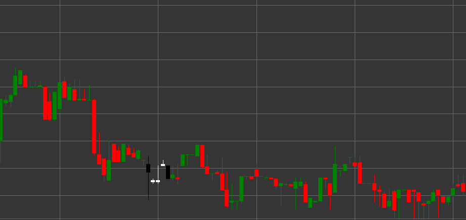

# Pattern Falling Three Methods

Falling Three Methods is a bearish trend continuation pattern consisting of five candles that forms in a downtrend. This pattern shows a temporary consolidation or rest within an existing downtrend before its continuation.

##### Key Features:

- First candle is black (bearish) with opening price higher than closing price (O > C) and a long body.
- The next three candles are white (bullish) with opening price lower than closing price (O < C), with small bodies (B * 3 < pB), (B == pB), (B == pB).
- The bodies of the three middle candles do not extend beyond the range of the first candle.
- Fifth candle is black (bearish) with opening price higher than closing price (O > C) and a long body (B > pB * 3).
- The fifth candle breaks through the low of the first candle and closes lower.
- Forms in a downtrend.

### Interpretation

Falling Three Methods is considered a reliable signal of downtrend continuation:

- The first long black candle shows the strength of the downtrend.
- Three small white candles represent a temporary consolidation or correction, during which buyers were unable to significantly change the trend.
- The fifth long black candle confirms the return of control to sellers and the continuation of the downtrend.
- This pattern can be viewed as a flag or pennant in classical technical analysis.
- Such a sequence of candles indicates that the correction was used to accumulate short positions before continuing the downward movement.

### Trading Strategies

Falling Three Methods provides good opportunities for entering or strengthening short positions:

- Enter a short position at the opening after the fifth candle or when the low of the first candle breaks.
- Place a stop-loss above the high of the correction candles or above the high of the first candle.
- Target profit can be set using a projection equal to the distance from the beginning of the trend to the first candle of the pattern.
- Pay attention to volume - ideally, volume decreases on the three middle candles and significantly increases on the fifth candle.
- Combine with other technical indicators to confirm the signal.
- Consider important support levels below the current price that may affect the development of the movement.

## See also

[Pattern Rising Three Methods](rising_three_methods.md)

[Pattern Three Black Crows](three_black_crows.md)