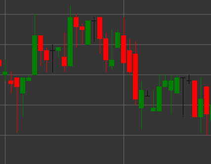

# Pattern Flat (Neutral) Candle

Flat (neutral) candle is a candlestick pattern that forms when the opening and closing prices are identical or very close. This candle reflects market indecision, when the forces of buyers and sellers are balanced.

##### Key Features:

- Opening price equals closing price (O == C).
- Upper and lower shadows can be of different lengths.
- Indicates neutrality or indecision in the market.
- May signal consolidation before continuation of the existing trend or a possible reversal.

### Interpretation

A flat candle by itself does not provide a clear signal about market direction, but can be useful in the context of previous candles and the overall trend:

- After a strong upward or downward movement, a flat candle may signal a weakening of momentum and possible reversal.
- During a sideways movement, a flat candle confirms the continuation of consolidation.
- The size of the shadows can provide additional information about market sentiment - long shadows indicate rejected attempts at price movement, while short shadows indicate low volatility.

### Trading Strategies

Flat candles are rarely used as standalone signals for position entry, but can help in making trading decisions:

- Look for confirmation from subsequent candles or other technical indicators before making a trade.
- Use flat candles to identify support or resistance levels in combination with other analysis methods.
- Increase stop-loss size or take profit if flat candles appear in a trend, which may indicate weakening movement.

## See also

[Pattern White Candle](white_candle.md)

[Pattern Black Candle](black_candle.md)