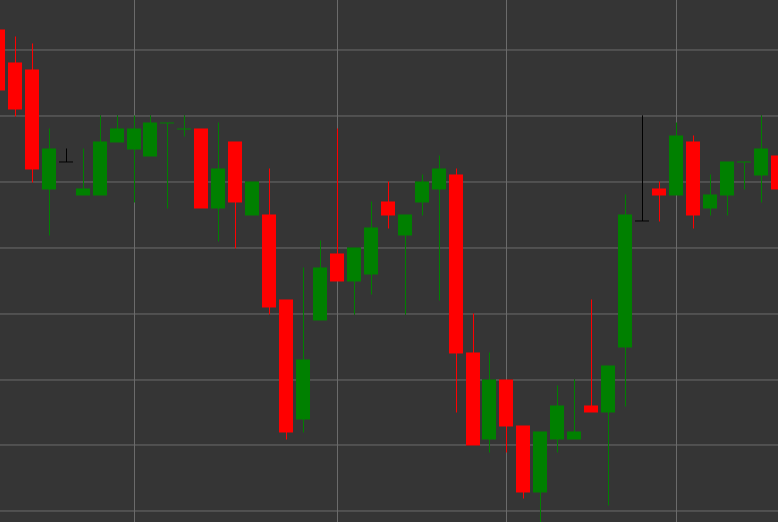

# Pattern Gravestone

Gravestone is a candlestick pattern characterized by equal opening and closing prices, a long upper shadow, and no lower shadow. The candle resembles the shape of an inverted letter "T," which gave it the name "gravestone."

##### Key Features:

- Opening price equals closing price (O == C).
- Long upper shadow.
- No lower shadow (BS == 0).
- Similar to a Shooting Star, but with a neutral body (doji).

### Interpretation

Gravestone Doji is considered a potential reversal signal, especially in an uptrend:

- The long upper shadow indicates that buyers controlled the market for most of the period, but then sellers returned the price to the opening level.
- The rejection of higher prices may signal the end of bullish momentum.
- Unlike a regular Shooting Star, the equality of opening and closing prices (doji) indicates a more pronounced balance of power.
- In an uptrend, this pattern has bearish implications and may foreshadow a reversal.
- In a downtrend, it may indicate temporary resistance or trend continuation.

### Trading Strategies

Gravestone requires additional confirmation for making trading decisions:

- Wait for a confirming bearish candle in the next period before entering a short position.
- Place a stop-loss above the maximum of the Gravestone.
- Use in conjunction with resistance levels or overbought conditions on indicators.
- Pay attention to volume - high volume during the formation of a Gravestone increases the credibility of the signal.
- Possible use for determining an exit point from long positions, even without entering a short position.

## See also

[Pattern Dragonfly](dragonfly.md)

[Pattern Shooting Star](shooting_star.md)