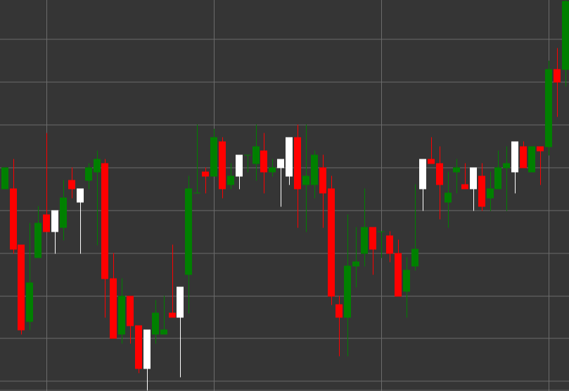

# Pattern Hammer

Hammer is a bullish candlestick pattern that forms during a downtrend. The candle has a small body at the upper part and a long lower shadow, with the upper shadow being absent or very short. The name comes from the candle's resemblance to a hammer.

##### Key Features:

- Opening price is lower than closing price (O < C), although it can be the opposite.
- Small candle body at the upper part of the price range.
- Long lower shadow, typically 2-3 times longer than the body.
- No upper shadow or a very short one.
- Forms in a downtrend.

### Interpretation

Hammer is considered a strong signal of a potential reversal of a downtrend:

- The long lower shadow shows that the price fell significantly during the period, but then buyers intervened and pushed the price back up.
- This indicates the market's rejection of lower prices and a potential shift in sentiment from bearish to bullish.
- The longer the lower shadow, the stronger the potential reversal signal.
- The color of the candle body is less important, although a white/green hammer is considered more bullish than a black/red one.

### Trading Strategies

Hammer provides opportunities for entering a long position:

- Wait for confirmation from the next candle - a bullish candle after a Hammer strengthens the reversal signal.
- Place a stop-loss level below the low of the Hammer.
- Set a target profit based on previous resistance levels or risk/reward ratio.
- Combine with other technical indicators, such as RSI or MACD, to confirm trend reversal.
- Higher trading volume during the formation of a Hammer increases the reliability of the signal.

## See also

[Pattern Inverted Hammer](inverted_hammer.md)

[Pattern Hanging Man](hanging_man.md)