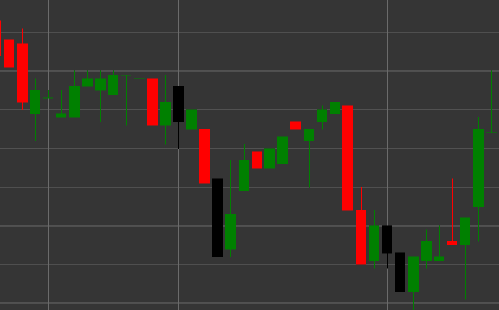

# Pattern Hanging Man

Hanging Man is a bearish reversal candlestick pattern that forms in an uptrend. The candle has a small body at the upper part and a long lower shadow, with the upper shadow being absent or very short. The shape of the candle resembles the figure of a man with hanging legs, hence the name.

##### Key Features:

- Opening price is higher than closing price (O > C), although it can be the opposite.
- Small candle body at the upper part of the price range.
- Long lower shadow, typically 2-3 times longer than the body.
- No upper shadow or a very short one (TS == 0).
- Forms in an uptrend.

### Interpretation

Hanging Man is considered a warning of a potential end to an uptrend:

- The long lower shadow shows that the price dropped significantly during the trading session, indicating the emergence of sellers.
- Despite the fact that buyers were able to push the price back to the upper part of the range, the very fact of a significant price drop in an uptrend is a warning signal.
- The color of the candle body is less important, although a black/red body is considered more bearish than a white/green one.
- The longer the lower shadow and the smaller the candle body, the stronger the signal.
- This pattern requires confirmation from subsequent candles.

### Trading Strategies

Hanging Man usually requires additional confirmation before making trading decisions:

- Wait for a confirming bearish candle after the Hanging Man formation before entering a short position.
- Place a stop-loss above the high of the Hanging Man.
- Consider trading volume - high volume during pattern formation and on the confirming candle strengthens the bearish signal.
- Combine with other technical indicators, such as RSI in the overbought zone or divergence on oscillators.
- Possible use for partial closing of existing long positions even without opening a short position.
- Pay special attention to the pattern if it forms at important resistance levels or after a prolonged upward movement.

## See also

[Pattern Hammer](hammer.md)

[Pattern Shooting Star](shooting_star.md)