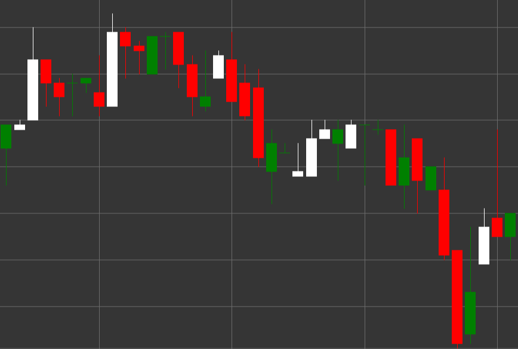

# Pattern Inverted Hammer

Inverted Hammer is a bullish candlestick pattern that forms during a downtrend. The candle has a small body at the lower part and a long upper shadow, with the lower shadow being absent or very short. It looks like an upside-down hammer.

##### Key Features:

- Opening price is lower than closing price (O < C), although it can be the opposite.
- Small candle body at the lower part of the price range.
- Long upper shadow, typically 2-3 times longer than the body.
- No lower shadow or a very short one.
- Forms in a downtrend.

### Interpretation

Inverted Hammer is considered a potential signal of a downtrend reversal:

- The long upper shadow shows that buyers tried to push the price significantly higher but couldn't maintain it at high levels.
- Despite the inability to close at the highs, the appearance of buyers after a prolonged downtrend may signal a change in sentiment.
- This pattern is not as strong as the classic Hammer and requires confirmation from subsequent candles.
- The color of the body is less important, although a white/green Inverted Hammer is considered more bullish.

### Trading Strategies

Inverted Hammer requires a cautious approach and confirmation:

- Mandatory waiting for confirmation from the next candle - a strong bullish candle after an Inverted Hammer significantly increases the probability of a reversal.
- Placing a stop-loss level below the low of the Inverted Hammer.
- Using a smaller position size compared to more reliable reversal patterns.
- Combining with oversold indicators such as RSI or Stochastic to increase the probability of a successful trade.
- Paying attention to trading volume - high volume increases the significance of the signal.

## See also

[Pattern Hammer](hammer.md)

[Pattern Shooting Star](shooting_star.md)