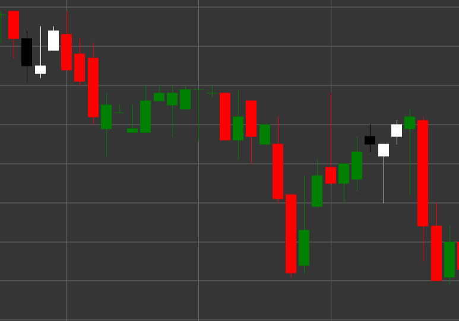

# Pattern Morning Star

Morning Star is a bullish reversal candlestick pattern consisting of three candles that forms in a downtrend. This pattern shows a transition from bearish to bullish sentiment through a period of uncertainty or consolidation.

##### Key Features:

- First candle is black (bearish) with opening price higher than closing price (O > C).
- Second candle has a small body (can be either bullish or bearish) and forms a gap down from the first candle. The candle length is significantly smaller than the first ((O < C) && (LEN > B * 3)).
- Third candle is white (bullish) with opening price lower than closing price (O < C), which closes deep inside the body of the first candle.
- Forms in a downtrend.

### Interpretation

Morning Star is considered a strong signal of a potential reversal of a downtrend:

- The first candle confirms the strength of the bearish trend.
- The second candle (star) shows weakening of bearish pressure and uncertainty in the market.
- The third candle demonstrates the return of buyers and a shift in control from bears to bulls.
- The deeper the third candle penetrates into the body of the first candle, the stronger the reversal signal.
- If the second candle is a doji (with a very small body), the pattern is called "Morning Doji Star" and is considered an even stronger signal.

### Trading Strategies

Morning Star provides good opportunities for entering a long position:

- Enter a long position after the pattern formation, usually at the opening of the fourth candle or when the high of the third candle breaks.
- Place a stop-loss below the low of the second candle or the low of the entire pattern.
- Target profit can be set based on Fibonacci levels relative to the previous downward movement or previous resistance levels.
- Pay attention to volume - increasing volume on the third candle confirms the strength of the bullish reversal.
- Combine with other technical indicators, such as RSI in the oversold zone or support lines, to increase the reliability of the signal.

## See also

[Pattern Evening Star](evening_star.md)

[Pattern Three White Soldiers](three_white_soldiers.md)