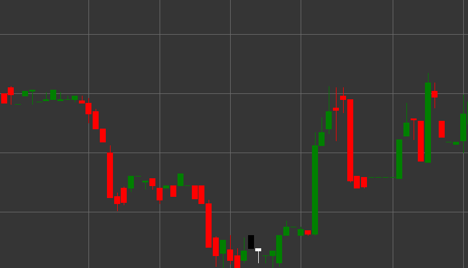

# Pattern On-Neck

On-Neck is a bearish trend continuation candlestick pattern consisting of two candles that forms in a downtrend. This pattern shows a temporary unsuccessful attempt by bulls to reverse the trend, after which the downward movement continues.

##### Key Features:

- First candle is black (bearish) with opening price higher than closing price (O > C) and a relatively long body.
- Second candle is white (bullish) with opening price lower than closing price ((C > O) && (pL == H)).
- Closing price of the second candle is around (or at the level of) the low of the first candle.
- Forms in a downtrend.

### Interpretation

On-Neck is considered a signal of downtrend continuation:

- The first candle confirms the existing downtrend.
- The second candle starts with a gap down, indicating continued bearish pressure.
- However, during the session, bulls attempt to reverse the movement, but can only push the price up to the low of the previous candle.
- The closing of the second candle at the level of the low of the first candle indicates that buyers could not overcome this resistance level.
- This signals a likely continuation of the downtrend.

### Trading Strategies

On-Neck provides opportunities to enter or strengthen short positions:

- Enter a short position or add to an existing short position after the pattern formation, usually at the opening of the third candle.
- Place a stop-loss above the high of the second candle or, for more protection, above the high of the first candle.
- Target profit can be set based on previous support levels or using technical measurement methods, such as projecting the height of the first candle.
- Pay attention to volume - decreasing volume on the second candle and increasing on subsequent bearish candles enhances the credibility of the signal.
- Combine with other indicators and patterns to increase the probability of a successful trade.
