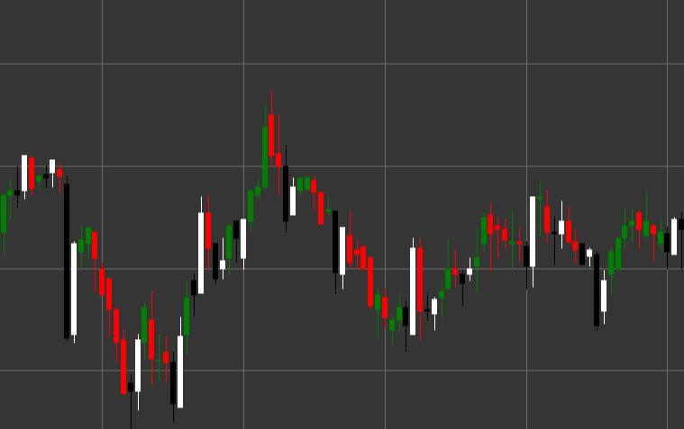

# Pattern Piercing

Piercing is a bullish reversal candlestick pattern consisting of two candles that forms in a downtrend. The first candle is black (bearish), followed by a white (bullish) candle that opens below the low of the previous candle and closes above the midpoint of the body of the previous candle.

##### Key Features:

- First candle is black with opening price higher than closing price (O > C).
- Second candle is white with opening price lower than closing price (O < C).
- Closing price of the second candle penetrates deeply into the body of the first candle, closing above the midpoint of the first candle (C > (pB / 2 + pC)).
- Forms in a downtrend.

### Interpretation

Piercing is considered a reliable signal of a potential reversal of a downtrend:

- The opening of the second candle below the low of the first candle (gap down) shows continued bearish pressure.
- However, during the trading session, bulls take control and push the price significantly higher, closing the candle above the midpoint of the body of the previous candle.
- This demonstrates a sharp shift in sentiment from bearish to bullish.
- The deeper the penetration into the second half of the body of the first candle, the stronger the signal.
- If the closing price of the second candle is above the opening price of the first candle, the pattern transitions to the "Bullish Engulfing" category, which is considered an even stronger signal.

### Trading Strategies

Piercing provides good opportunities for entering a long position:

- Enter a position after confirming the pattern (usually at the opening of the third candle or when the high of the second candle breaks).
- Place a stop-loss below the low of the second candle or the low of the entire pattern.
- Target profit can be set based on previous resistance levels or Fibonacci levels.
- Consider trading volume - high volume during the formation of the second candle enhances the credibility of the signal.
- Additional confirmation from oversold indicators, such as RSI or Stochastic, increases the probability of a successful trade.

## See also

[Pattern Bullish Engulfing](bullish_engulfing.md)