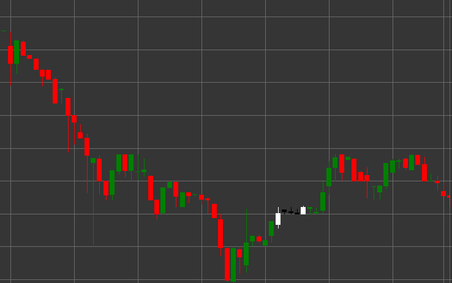

# Pattern Rising Three Methods

Rising Three Methods is a bullish trend continuation pattern consisting of five candles that forms in an uptrend. This pattern shows a temporary consolidation or rest within an existing uptrend before its continuation.

##### Key Features:

- First candle is white (bullish) with opening price lower than closing price (O < C) and a long body.
- The next three candles are black (bearish) with opening price higher than closing price (O > C), with small bodies (B * 3 < pB), (B == pB), (B == pB).
- The bodies of the three middle candles do not extend beyond the range of the first candle.
- Fifth candle is white (bullish) with opening price lower than closing price (O < C) and a long body (B > pB * 3).
- The fifth candle breaks through the high of the first candle and closes higher.
- Forms in an uptrend.

### Interpretation

Rising Three Methods is considered a reliable signal of uptrend continuation:

- The first long white candle shows the strength of the uptrend.
- Three small black candles represent a temporary consolidation or correction, during which sellers were unable to significantly change the trend.
- The fifth long white candle confirms the return of control to buyers and the continuation of the uptrend.
- This pattern can be viewed as a flag or pennant in classical technical analysis.
- Such a sequence of candles indicates that the correction was used to accumulate long positions before continuing the upward movement.

### Trading Strategies

Rising Three Methods provides good opportunities for entering or strengthening long positions:

- Enter a long position at the opening after the fifth candle or when the high of the first candle breaks.
- Place a stop-loss below the low of the correction candles or below the low of the first candle.
- Target profit can be set using a projection equal to the distance from the beginning of the trend to the first candle of the pattern.
- Pay attention to volume - ideally, volume decreases on the three middle candles and significantly increases on the fifth candle.
- Combine with other technical indicators to confirm the signal.
- Consider important resistance levels above the current price that may affect the development of the movement.

## See also

[Pattern Falling Three Methods](falling_three_methods.md)

[Pattern Three White Soldiers](three_white_soldiers.md)