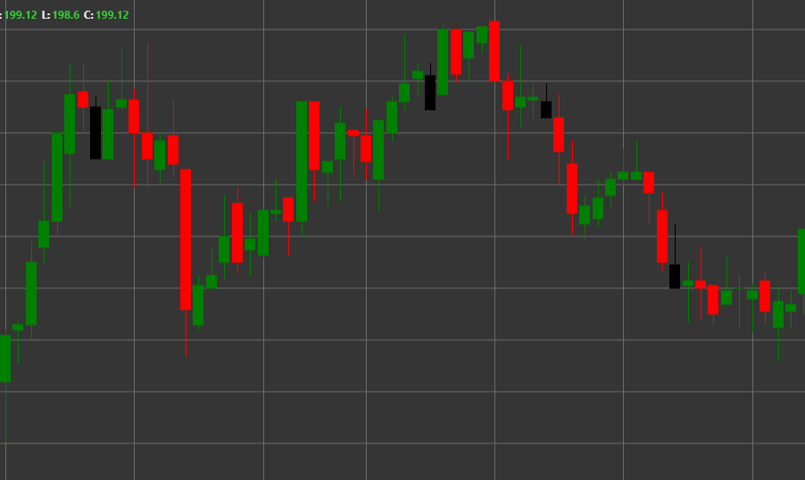

# Pattern Shooting Star

Shooting Star is a bearish reversal candlestick pattern that forms in an uptrend. The candle has a small body at the lower part and a long upper shadow, with the lower shadow being absent or very short. It resembles a star with an upward-pointing tail.

##### Key Features:

- Opening price is higher than closing price (O > C), although it can be the opposite.
- Small candle body at the lower part of the price range.
- Long upper shadow, typically 2-3 times longer than the body.
- No lower shadow or a very short one (BS == 0).
- Forms in an uptrend.

### Interpretation

Shooting Star is considered a strong signal of a potential reversal of an uptrend:

- The long upper shadow shows that the price rose significantly during the trading session, but then sellers intervened and pushed the price down.
- This indicates the market's rejection of higher prices and a potential shift in sentiment from bullish to bearish.
- The longer the upper shadow, the stronger the potential reversal signal.
- The color of the candle body is less important, although a black/red Shooting Star is considered more bearish than a white/green one.
- The pattern is similar to an Inverted Hammer, but forms in an uptrend and has the opposite meaning.

### Trading Strategies

Shooting Star provides opportunities for entering a short position:

- Wait for confirmation from the next candle - a bearish candle after a Shooting Star strengthens the reversal signal.
- Place a stop-loss level above the high of the Shooting Star.
- Set a target profit based on previous support levels or risk/reward ratio.
- Combine with other technical indicators, such as RSI in the overbought zone or MACD with bearish divergence, to confirm trend reversal.
- Higher trading volume during the formation of a Shooting Star increases the reliability of the signal.
- Particularly strong signal if the Shooting Star forms at an important resistance level or after a rapid price rise.

## See also

[Pattern Inverted Hammer](inverted_hammer.md)

[Pattern Hanging Man](hanging_man.md)