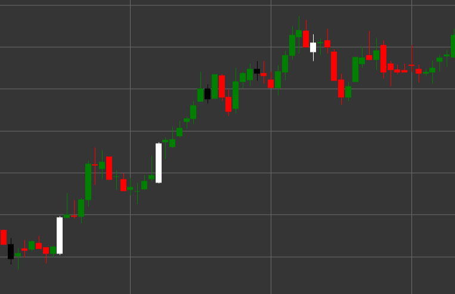

# Pattern Spinning Top

Spinning Top is a candlestick pattern characterized by a small candle body and long upper and lower shadows of approximately equal length. This pattern indicates market indecision and a struggle between buyers and sellers.

##### Key Features:

- Small candle body (can be either white/green or black/red).
- Long upper and lower shadows of approximately equal length.
- Indicates balance between bulls and bears.
- Reflects market indecision and potential trend change.

### Interpretation

Spinning Top signals indecision in the market:

- Long shadows show that during the period, the price fluctuated significantly both up and down.
- The small body means that the closing price didn't move far from the opening price, despite high volatility.
- Within an uptrend, it may signal a weakening of bullish momentum.
- Within a downtrend, it may indicate exhaustion of bearish pressure.
- At the top of a trend or before an important resistance level, it may foreshadow a reversal.

### Trading Strategies

Spinning Top by itself is not a strong trading signal, but can be used in combination with other factors:

- Look for additional confirmation from subsequent candles before making trading decisions.
- Use as part of more complex candlestick patterns, such as morning or evening stars.
- Increase attention to subsequent price movements after the formation of a Spinning Top at key support or resistance levels.
- Possible tightening of stop-losses when a Spinning Top appears after a prolonged trend.

## See also

[Pattern Hammer](hammer.md)

[Pattern Inverted Hammer](inverted_hammer.md)