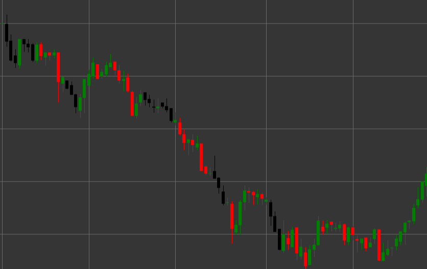

# Pattern Three Black Crows

Three Black Crows is a powerful bearish reversal candlestick pattern consisting of three consecutive candles that forms in an uptrend. This pattern indicates a decisive shift in control from buyers to sellers, signaling a potential reversal of an uptrend.

##### Key Features:

- Three consecutive black (bearish) candles with opening price higher than closing price (O > C).
- Each subsequent candle opens within the body of the previous candle (O < pO).
- Each candle closes lower than the closing of the previous candle.
- All three candles have relatively long bodies and short shadows.
- Forms in an uptrend.

### Interpretation

Three Black Crows is considered one of the most reliable signals of an uptrend reversal:

- The sequence of three declining candles shows a steady increase in bearish pressure.
- The opening of each subsequent candle within the body of the previous one indicates some consolidation, then continuation of the bearish movement.
- The closing of each candle lower than the previous demonstrates the ability of sellers to consistently lower the price.
- Relatively long candle bodies with short shadows indicate decisive bear control over the market.
- The more uniform the sizes of the three candles, the stronger the signal.

### Trading Strategies

Three Black Crows provides reliable opportunities for entering a short position:

- Enter a short position after the formation of the complete pattern, usually at the opening of the fourth candle.
- Place a stop-loss above the high of the third candle or above the high of the entire pattern.
- Target profit can be set based on Fibonacci levels or previous support levels.
- Pay attention to volume - increasing volume with each candle confirms the strength of the signal.
- Take a more cautious approach with extremely long candle bodies, as a short-term correction may follow due to oversold conditions.
- Combine with other technical indicators, such as RSI in the overbought zone, to increase the probability of a successful trade.
- Particularly strong signal if the pattern forms after a prolonged uptrend or at an important resistance level.

## See also

[Pattern Three White Soldiers](three_white_soldiers.md)

[Pattern Falling Three Methods](falling_three_methods.md)