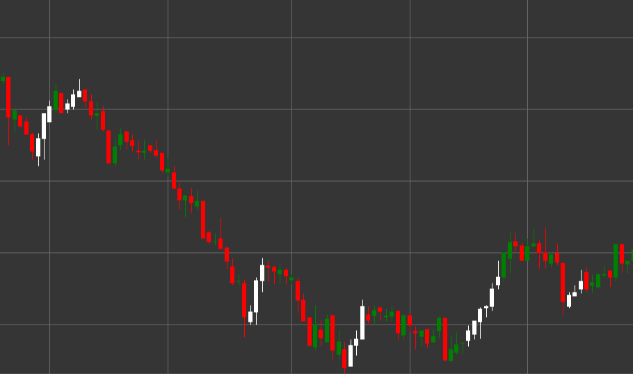

# Pattern Three White Soldiers

Three White Soldiers is a powerful bullish reversal candlestick pattern consisting of three consecutive candles that forms in a downtrend. This pattern indicates a decisive shift in control from sellers to buyers, signaling a potential reversal of a downtrend.

##### Key Features:

- Three consecutive white (bullish) candles with opening price lower than closing price (O < C).
- Each subsequent candle opens within the body of the previous candle (O > pO).
- Each candle closes higher than the closing of the previous candle.
- All three candles have relatively long bodies and short shadows.
- Forms in a downtrend.

### Interpretation

Three White Soldiers is considered one of the most reliable signals of a downtrend reversal:

- The sequence of three rising candles shows a steady increase in bullish pressure.
- The opening of each subsequent candle within the body of the previous one indicates some consolidation, then continuation of the bullish movement.
- The closing of each candle higher than the previous demonstrates the ability of buyers to consistently raise the price.
- Relatively long candle bodies with short shadows indicate decisive bull control over the market.
- The more uniform the sizes of the three candles, the stronger the signal.

### Trading Strategies

Three White Soldiers provides reliable opportunities for entering a long position:

- Enter a long position after the formation of the complete pattern, usually at the opening of the fourth candle.
- Place a stop-loss below the low of the third candle or below the low of the entire pattern.
- Target profit can be set based on Fibonacci levels or previous resistance levels.
- Pay attention to volume - increasing volume with each candle confirms the strength of the signal.
- Take a more cautious approach with extremely long candle bodies, as a short-term correction may follow due to overbought conditions.
- Combine with other technical indicators, such as RSI, to increase the probability of a successful trade.

## See also

[Pattern Three Black Crows](three_black_crows.md)

[Pattern Rising Three Methods](rising_three_methods.md)