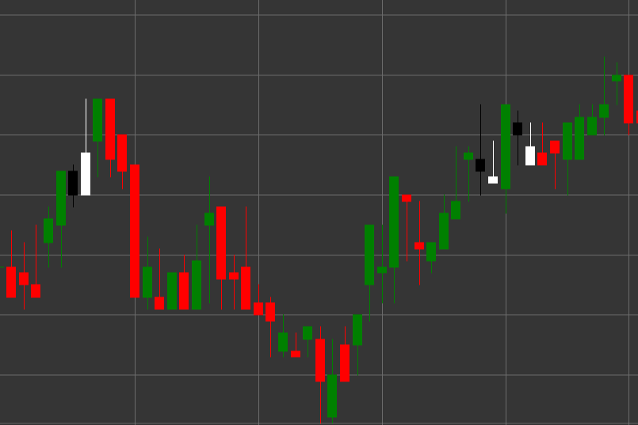

# Pattern Tweezer Bottom

Tweezer Bottom is a bullish reversal candlestick pattern consisting of two candles that forms in a downtrend. A characteristic feature of the pattern is that both candles have the same or nearly the same low, resembling tweezers with two identical ends.

##### Key Features:

- First candle is black (bearish) with opening price higher than closing price (O > C).
- Second candle is white (bullish) with opening price lower than closing price (O < C).
- The second candle has no lower shadow or a very short one (BS == 0).
- The upper shadow of the second candle is larger than its body (TS > B).
- Both candles have the same or very close lows.
- Forms in a downtrend.

### Interpretation

Tweezer Bottom is considered a signal of a potential reversal of a downtrend:

- The first candle confirms the existing downtrend.
- The second candle with the same low shows that bears twice tried to break through the same level but failed.
- This inability to overcome a certain level indicates weakening of bearish momentum and possible beginning of bullish movement.
- The absence of a lower shadow on the second candle with a long upper shadow indicates strong bullish pressure from the low level.
- The pattern is particularly significant if it forms at an important support level or after a prolonged downward movement.

### Trading Strategies

Tweezer Bottom requires a cautious approach and often additional confirmation:

- Wait for a confirming bullish candle after the pattern formation before entering a long position.
- Place a stop-loss slightly below the common low of the pattern.
- Consider trading volume - decreasing volume on the first candle and increasing on the second and subsequent bullish candles strengthens the signal.
- Combine with other technical indicators, such as RSI in the oversold zone or bullish divergence on oscillators.
- Possible use for partial or complete closing of existing short positions.
- Pay special attention to subsequent price movements - rapid price growth after the pattern confirms its significance.

## See also

[Pattern Tweezer Top](tweezer_top.md)

[Pattern Morning Star](morning_star.md)