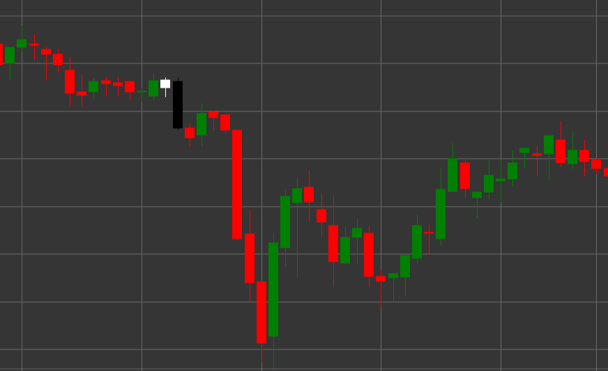

# Pattern Tweezer Top

Tweezer Top is a bearish reversal candlestick pattern consisting of two candles that forms in an uptrend. A characteristic feature of the pattern is that both candles have the same or nearly the same high, resembling tweezers with two identical ends.

##### Key Features:

- First candle is white (bullish) with opening price lower than closing price (O < C).
- Second candle is black (bearish) with opening price higher than closing price (O > C).
- Both candles have the same or very close highs (H == pH).
- The body of the second candle is significantly larger than the body of the first candle (B > (pB * 3)).
- Forms in an uptrend.

### Interpretation

Tweezer Top is considered a signal of a potential reversal of an uptrend:

- The first candle confirms the existing uptrend.
- The second candle with the same high shows that bulls twice tried to break through the same level but failed.
- This inability to overcome a certain level indicates weakening of bullish momentum and possible beginning of bearish movement.
- The more significant body of the second candle compared to the first enhances the bearish signal.
- The pattern is particularly significant if it forms at an important resistance level or after a prolonged upward movement.

### Trading Strategies

Tweezer Top requires a cautious approach and often additional confirmation:

- Wait for a confirming bearish candle after the pattern formation before entering a short position.
- Place a stop-loss slightly above the common high of the pattern.
- Consider trading volume - decreasing volume on the first candle and increasing on the second and subsequent bearish candles strengthens the signal.
- Combine with other technical indicators, such as RSI in the overbought zone or divergence on oscillators.
- Possible use for partial or complete closing of existing long positions.
- Pay special attention to subsequent price movements - rapid price decline after the pattern confirms its significance.

## See also

[Pattern Tweezer Bottom](tweezer_bottom.md)

[Pattern Evening Star](evening_star.md)