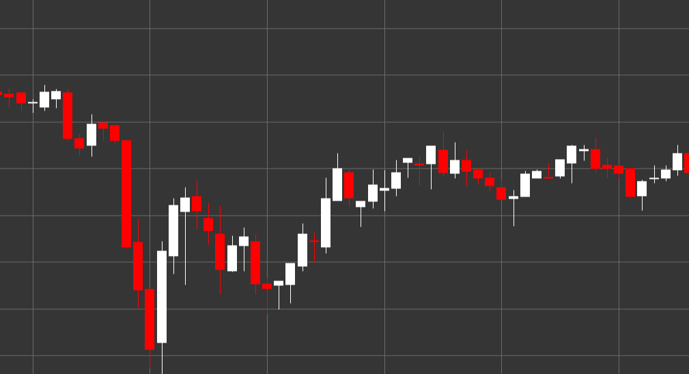

# Pattern White Candle

White candle (bullish candle) is a classic candlestick pattern that forms when the closing price is higher than the opening price. This candle reflects a bullish market sentiment, where buyers controlled the price during the period of candle formation.

##### Key Features:

- Opening price is lower than closing price (O < C).
- The candle body is usually colored white (or green in modern charts).
- Indicates the predominance of buyers over sellers.
- The size of the candle body shows the strength of the bullish movement.

### Interpretation

White candle signals bullish pressure in the market:

- The longer the candle body, the stronger the bullish pressure.
- A long white candle after a downtrend may indicate a potential reversal.
- The presence of short shadows indicates that bulls controlled the price throughout the period.
- Consecutive white candles indicate a steady uptrend.

### Trading Strategies

Although a single white candle is not usually an independent trading signal, it can be used as part of a broader strategy:

- Confirmation of an uptrend or reversal after a downward movement.
- Looking for long white candles at support levels for potential long positions.
- Using in combination with other candlestick patterns, for example, a white candle after a bullish engulfing.
- Identifying resistance levels after a series of consecutive white candles.

## See also

[Pattern Black Candle](black_candle.md)

[Pattern White Marubozu](white_marubozu.md)