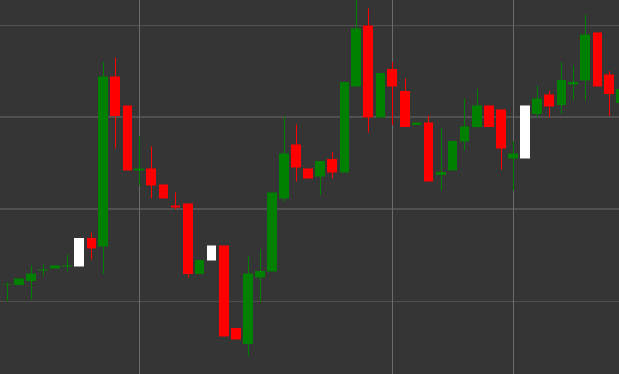

# Pattern White Marubozu

White Marubozu is a bullish candlestick pattern characterized by the absence of shadows on both ends of the candle. The term "marubozu" comes from the Japanese word meaning "bald-headed" or "shaved," reflecting the appearance of the candle without shadows.

##### Key Features:

- Opening price is lower than closing price (O < C).
- The candle body is completely filled, without upper and lower shadows.
- Opening price equals the low of the candle, and closing price equals the high of the candle.
- Represents a strong bullish movement, where buyers controlled the price throughout the period.

### Interpretation

White Marubozu is considered a strong bullish signal:

- The absence of shadows indicates complete buyer domination - the price opened at the low and continuously rose until the period closed.
- A long White Marubozu indicates very strong bullish pressure.
- The appearance of this pattern after a downtrend may signal a reversal.
- Within an uptrend, it confirms the strength of the movement.

### Trading Strategies

White Marubozu provides a stronger signal than a regular white candle:

- Opportunity to enter a long position after the formation of a White Marubozu, especially if it appears at an important support level.
- Using the closing price of White Marubozu as a support level when setting stop-losses.
- Combining with other technical indicators to confirm the signal.
- Paying attention to trading volume - high volume enhances the significance of the signal.

## See also

[Pattern Black Marubozu](black_marubozu.md)

[Pattern White Candle](white_candle.md)