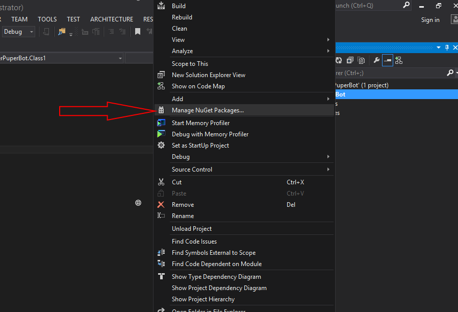
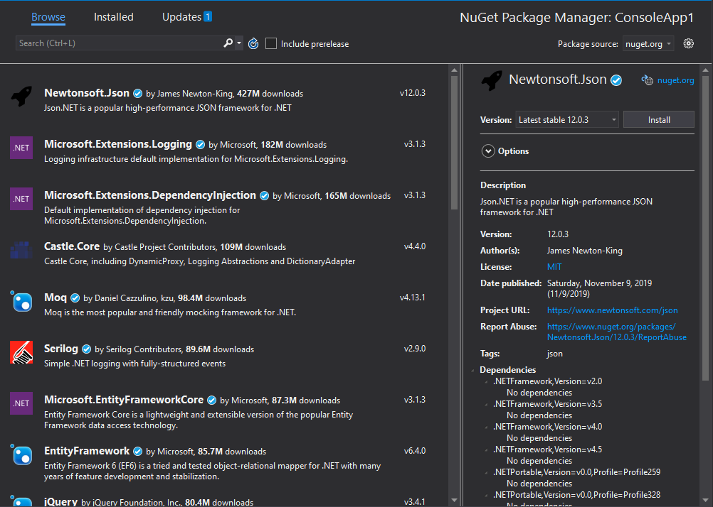
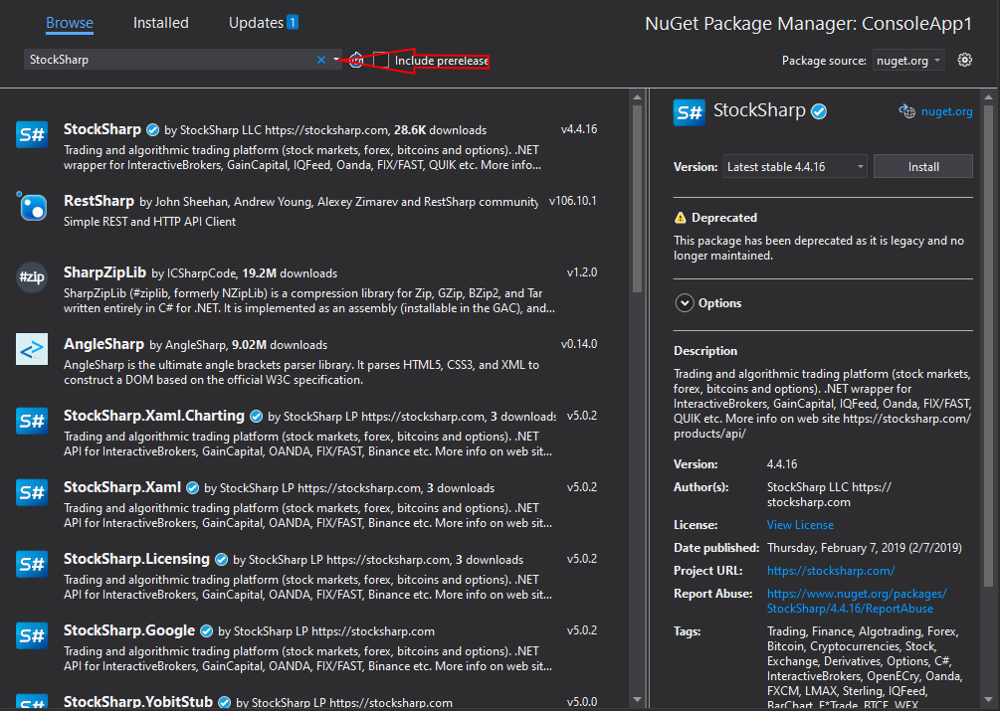
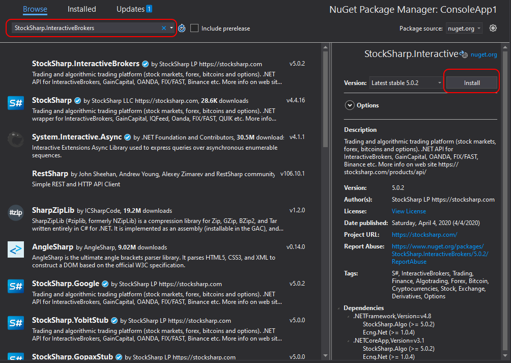
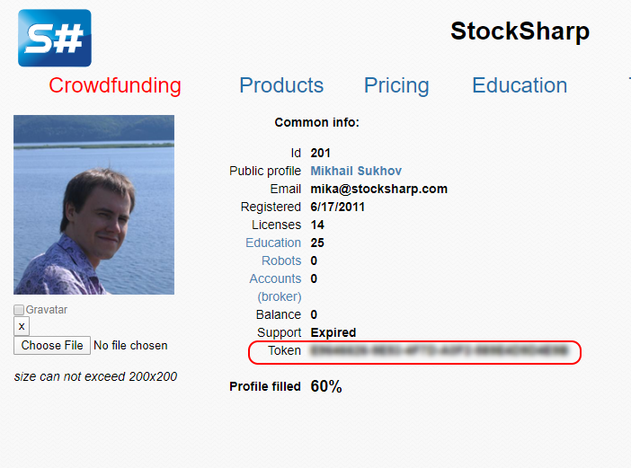
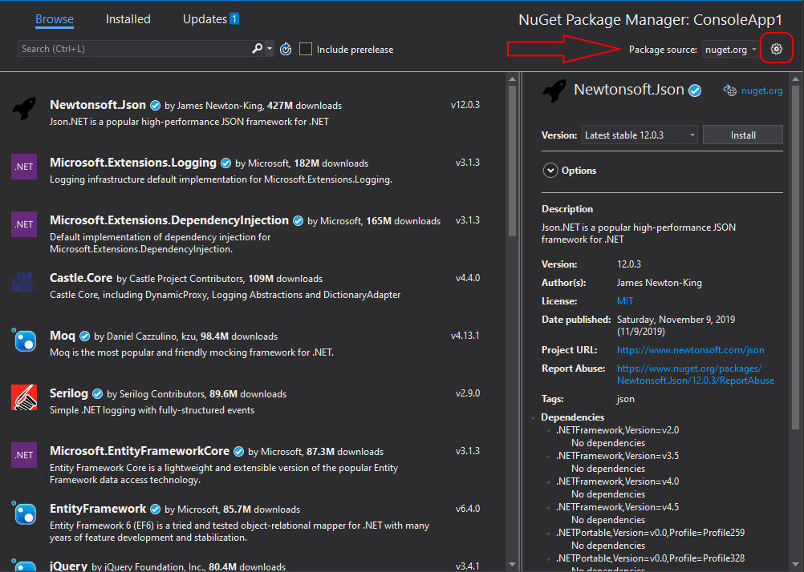
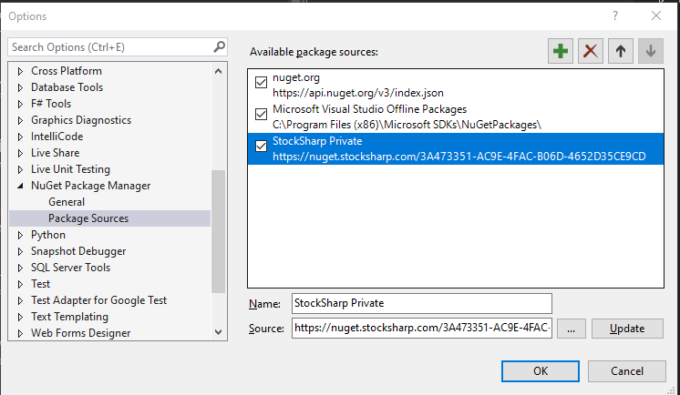
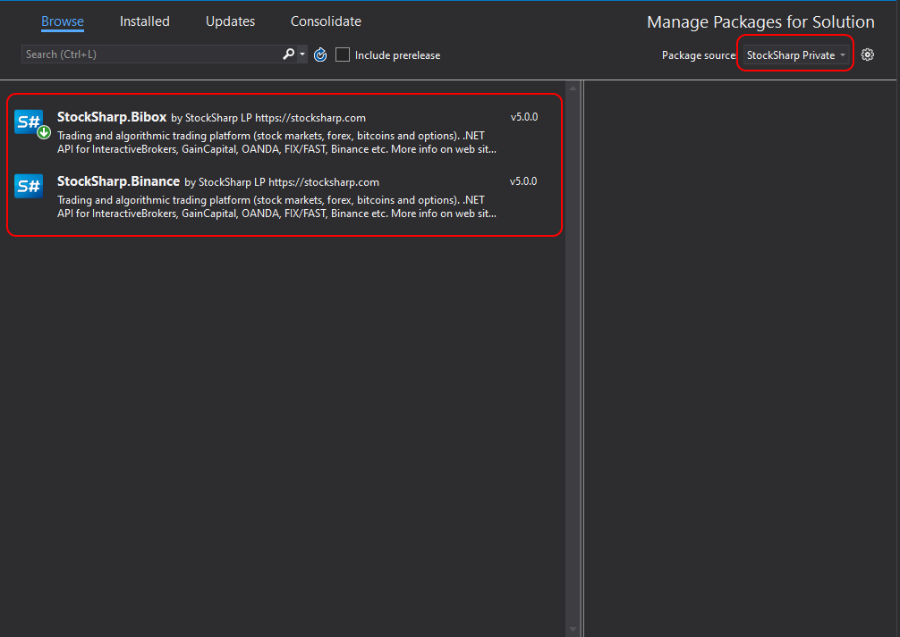
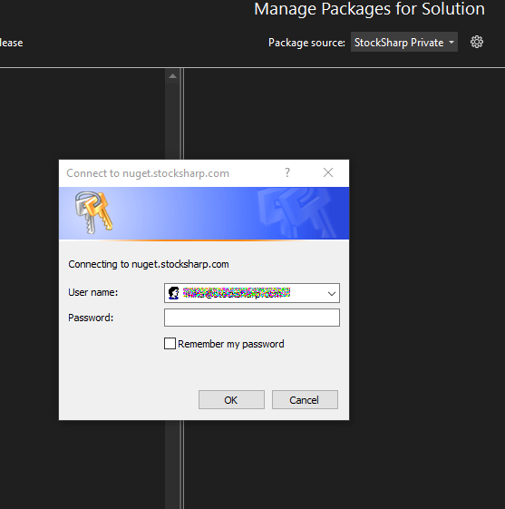
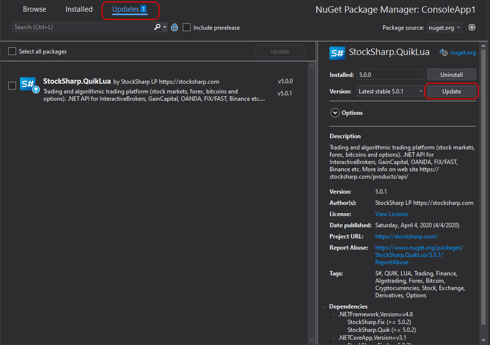

# API Installation

NuGet is a package management system integrated into Visual Studio. It makes it easy to install and update packages, including [S#](../api.md).

All [S#](../api.md) packages are compiled for .NET 6. This is a cross-platform version (connectors, [backtesting](testing.md), [storage](market_data_storage.md), etc. are available in any OS), but [graphical components](graphical_user_interface.md) are supported only on Windows.

## Public NuGet Server

1. Right-click on the project and select **Manage NuGet Packages...** from the context menu:

2. A window will appear as shown in the picture:

3. In the search box in the top right corner, type "StockSharp":

4. [S#](../api.md) is divided into several NuGet packages:
 - [StockSharp.Algo](https://www.nuget.org/packages/StockSharp.Algo/) - basic algorithms and [testing](testing.md)
 - [StockSharp.Binance](https://www.nuget.org/packages/StockSharp.Binance/) - [connectors](connectors.md) to brokers
 - [StockSharp.Xaml.Charting](https://www.nuget.org/packages/StockSharp.Xaml.Charting/) - [graphical components](graphical_user_interface.md) for displaying candlestick charts and [indicators](indicators.md)

When you select a package, all dependencies will be installed automatically.

5. Select the desired package and click **Install**:

6. After installation, [S#](../api.md) files will be added to the packages folder and linked as references in the project.

Trading robot [examples](examples.md) are available on [GitHub](https://github.com/stocksharp/stocksharp/tree/master/Samples).

## Private NuGet Server

Some components (like crypto-[connectors](connectors.md)) are only available through the private NuGet server for registered users.

There are two ways to connect:

### Method 1: Authentication via token in the address

1. Register on the StockSharp website.

2. Copy the token from your [personal account](https://stocksharp.ru/profile/):

3. Follow steps 1 and 2 from the **Public NuGet Server** section and open the available feeds settings window:

4. In the window that appears, add a new feed by specifying the address as `https://nuget.stocksharp.com/{token}/v3/index.json`. For example, `https://nuget.stocksharp.com/AAHBWDNOINXWNJNWD/v3/index.json`:

5. Click **OK** and select the created feed. If you have access to private components, a list of available NuGet packages will appear:

6. Select the desired package and click the **Install** button.

### Method 2: Authentication via username and password

1. Add a package source with the address `https://nuget.stocksharp.com/x/v3/index.json`.

2. When you try to use this source, an authentication window will appear:

3. Enter your StockSharp account username and password. You can save your credentials to avoid entering them each time.

4. After successful authentication, you will have access to private packages.

5. If you prefer token authentication, you can enter "x" in the username field and your token in the password field.

If you need to reset saved credentials:
1. Open "Credential Manager" in Windows (Control Panel → User Accounts → Credential Manager)
2. Find VSCredentials related to nuget.stocksharp.com in the list
3. Delete these credentials

## Package Updates

To check for updates:

1. Open **Manage NuGet Packages...**
2. Go to the **Updates** tab
3. Select the packages to update and click **Update**

> [!WARNING]
> To check for updates on public and private servers, you need to switch the package source, as VS 2019 does not track multiple sources simultaneously.

## Installer

[Installer](../installer.md) is a special application for simplified installation of all StockSharp products.