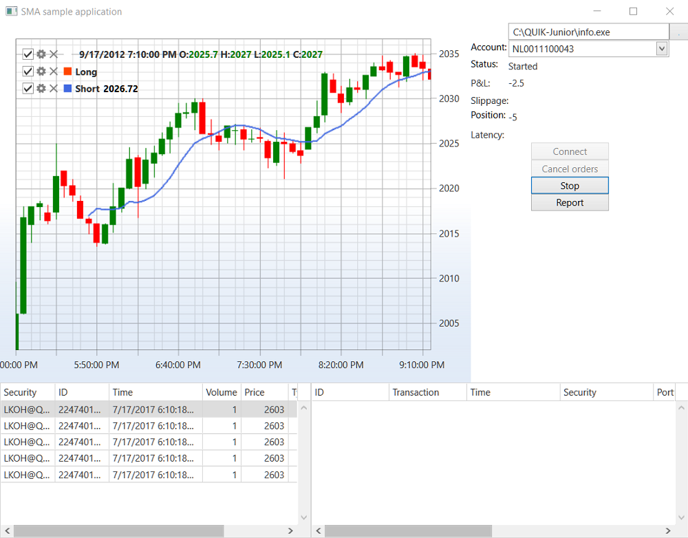

# Iteration model

Along with the event\-driven approach for [strategies creating](), in the [S\#](../../api.md) you can create code for a strategy based on an iteration model. This approach should be used when you want a simple strategy implementation, is not critical to the execution speed. 

To create a strategy based on an iteration model the [TimeFrameStrategy](xref:StockSharp.Algo.Strategies.TimeFrameStrategy) class is used. When you use this class, the main trading algorithm code should be focused in the [TimeFrameStrategy.OnProcess](xref:StockSharp.Algo.Strategies.TimeFrameStrategy.OnProcess) method. This method call frequency depends on the [TimeFrameStrategy.Interval](xref:StockSharp.Algo.Strategies.TimeFrameStrategy.Interval) value. The approach in the [TimeFrameStrategy](xref:StockSharp.Algo.Strategies.TimeFrameStrategy) using is iteration processing: the beginning of the method \-\> check the state of the market \-\> orders registration (or cancel) \-\> method end. With this approach, you need to store the states for the next method call could get the data created in the previous call. 

The example of the [Moving Average](https://en.wikipedia.org/wiki/Moving_average#Simple_moving_average) trading algorithm (its simple implementation) shows the iteration model work. In example the inheriting class [TimeFrameStrategy](xref:StockSharp.Algo.Strategies.TimeFrameStrategy) implemented, which stores the state of moving crosses (the long is above or below the short one) between the [TimeFrameStrategy.OnProcess](xref:StockSharp.Algo.Strategies.TimeFrameStrategy.OnProcess) method calls. 



## The moving average algorithm:

1. Historical data are necessary for this algorithm, so, for example, the 5\-minutes were downloaded from the [IQFeed](../connectors/stock_market/iqfeed.md) site on the AAPL paper and saved to the AAPL\_history.txt file. 

   > [!TIP]
   > Before starting the program it is recommended to update the data by downloading them from the website. The correct data format can be viewed in the test file. 
2. The simple moving average formula: *SMA \= (P<sub>m</sub>m + P<sub>m-1</sub>m\-1 + ... + P<sub>m-n</sub>m\-n) \/ n *

   Indicators implemented in the [StockSharp.Algo.Indicators](xref:StockSharp.Algo.Indicators) namespace. For more details see [Indicators](../indicators.md). 
3. The implementation code of the trading strategy for moving average: 

   ```cs
   class SmaStrategy : Strategy
   {
   	private readonly Connector _connector;
   	private readonly CandleSeries _series;
   	private bool _isShortLessThenLong;
   	public SmaStrategy(CandleSeries series, SimpleMovingAverage longSma, SimpleMovingAverage shortSma)
   	{
   		_series = series;
   		_connector = ((Connector)this.Connector);
   		LongSma = longSma;
   		ShortSma = shortSma;
   	}
   	public SimpleMovingAverage LongSma { get; }
   	public SimpleMovingAverage ShortSma { get; }
   	protected override void OnStarted()
   	{
   		_connector
   			.WhenCandlesFinished(_series)
   			.Do(ProcessCandle)
   			.Apply(this);
   		// store current values for short and long
   		_isShortLessThenLong = ShortSma.GetCurrentValue() < LongSma.GetCurrentValue();
   		base.OnStarted();
   	}
   	private void ProcessCandle(Candle candle)
   	{
   		// strategy are stopping
   		if (ProcessState == ProcessStates.Stopping)
   		{
   			CancelActiveOrders();
   			return;
   		}
   		// process new candle
   		LongSma.Process(candle);
   		ShortSma.Process(candle);
   		// calc new values for short and long
   		var isShortLessThenLong = ShortSma.GetCurrentValue() < LongSma.GetCurrentValue();
   		// crossing happened
   		if (_isShortLessThenLong != isShortLessThenLong)
   		{
   			// if short less than long, the sale, otherwise buy
   			var direction = isShortLessThenLong ? Sides.Sell : Sides.Buy;
   			// calc size for open position or revert
   			var volume = Position == 0 ? Volume : Position.Abs() * 2;
   			// register order (limit order)
   			//RegisterOrder(this.CreateOrder(direction, (decimal)Security.GetCurrentPrice(direction), volume));
   			// or revert position via market quoting
   			var strategy = new MarketQuotingStrategy(direction, volume);
   			ChildStrategies.Add(strategy);
   			// store current values for short and long
   			_isShortLessThenLong = isShortLessThenLong;
   		}
   	}
   }
   ```

   At the beginning of the method through the [Strategy.ProcessState](xref:StockSharp.Algo.Strategies.Strategy.ProcessState) property it is checked to see if the strategy is in the process of stopping (for example, the [Strategy.Stop](xref:StockSharp.Algo.Strategies.Strategy.Stop) method has been called or an error occurred). If the strategy is in the process of stopping, then all active orders are cancelled through the [Strategy.CancelActiveOrders](xref:StockSharp.Algo.Strategies.Strategy.CancelActiveOrders), method, to prevent their activation at unfavorable prices. If you want not only to cancel orders, but also to close the position, you can use the [StrategyHelper.ClosePosition](xref:StockSharp.Algo.Strategies.StrategyHelper.ClosePosition(StockSharp.Algo.Strategies.Strategy,System.Decimal))**(**[StockSharp.Algo.Strategies.Strategy](xref:StockSharp.Algo.Strategies.Strategy) strategy, [System.Decimal](xref:System.Decimal) slippage **)** method. 

   If it is impossible to stop the strategy at the moment for some reason, and it takes some time, it is necessary to return the [ProcessResults.Continue](xref:StockSharp.Algo.Strategies.ProcessResults.Continue) value, and to try to finalize the strategy work in the next iteration of the [TimeFrameStrategy.OnProcess](xref:StockSharp.Algo.Strategies.TimeFrameStrategy.OnProcess) call. That is why after calling the [Strategy.Stop](xref:StockSharp.Algo.Strategies.Strategy.Stop) method the strategy is not immediately changing its state to the [ProcessStates.Stopped](xref:StockSharp.Algo.ProcessStates.Stopped). In case of the SmaStrategy such a situation can not occured, as there are no special circumstances in the implementation of the moving average. Therefore, the [ProcessResults.Stop](xref:StockSharp.Algo.Strategies.ProcessResults.Stop) is returned immediately when strategy stops. 

   The code of work with moving average goes after checking. **Important\!** The [Strategy](xref:StockSharp.Algo.Strategies.Strategy) class has the [Strategy.RegisterOrder](xref:StockSharp.Algo.Strategies.Strategy.RegisterOrder(StockSharp.BusinessEntities.Order))**(**[StockSharp.BusinessEntities.Order](xref:StockSharp.BusinessEntities.Order) order **)** method, which must be called instead of direct registration through the ([Connector.RegisterOrder](xref:StockSharp.Algo.Connector.RegisterOrder(StockSharp.BusinessEntities.Order))**(**[StockSharp.BusinessEntities.Order](xref:StockSharp.BusinessEntities.Order) order **)**) connector. All trades that have taken place on such order will be captured by the [Strategy](xref:StockSharp.Algo.Strategies.Strategy). And on the basis of these trades the calculation of position, slippage, P&L etc. will be done. In addition, such orders and trades will be added to the [Strategy.Orders](xref:StockSharp.Algo.Strategies.Strategy.Orders) and [Strategy.MyTrades](xref:StockSharp.Algo.Strategies.Strategy.MyTrades) collections, so you can view all the orders and trades created within the framework of the strategy. 

   > [!TIP]
   > If you want to change the registered order, you also have to call [Strategy.ReRegisterOrder](xref:StockSharp.Algo.Strategies.Strategy.ReRegisterOrder(StockSharp.BusinessEntities.Order,StockSharp.BusinessEntities.Order))**(**[StockSharp.BusinessEntities.Order](xref:StockSharp.BusinessEntities.Order) oldOrder, [StockSharp.BusinessEntities.Order](xref:StockSharp.BusinessEntities.Order) newOrder **)** method, and not to apply directly to the connector through the [Connector.ReRegisterOrder](xref:StockSharp.Algo.Connector.ReRegisterOrder(StockSharp.BusinessEntities.Order,StockSharp.BusinessEntities.Order))**(**[StockSharp.BusinessEntities.Order](xref:StockSharp.BusinessEntities.Order) oldOrder, [StockSharp.BusinessEntities.Order](xref:StockSharp.BusinessEntities.Order) newOrder **)** method. 

   At the end of the method the [ProcessResults.Continue](xref:StockSharp.Algo.Strategies.ProcessResults.Continue), value returned, which means that the strategy has not finished its work and you need to call it again. If any other algorithm that has a termination criterion (for example, the position change until a certain value) implements, then in case of operation termination of such algorithm it is necessary to return the [ProcessResults.Stop](xref:StockSharp.Algo.Strategies.ProcessResults.Stop) value. 
4. Initialization of the strategy itself and filling in its by the historical data: 

   ```cs
   _connector.Connected += () =>
   {
   	_connector.NewSecurity += security =>
   	{
   		if (!security.Code.CompareIgnoreCase("AAPL"))
   			return;
   		_aapl = security;
   		this.GuiAsync(() =>
   		{
   			Start.IsEnabled = true;
   		});
   	};
   	_connector.NewMyTrade += trade =>
   	{
   		if (_strategy != null)
   		{
   			if (_strategy.Orders.Contains(trade.Order))
   				Trades.Trades.Add(trade);
   		}
   	};
   	_connector.CandleSeriesProcessing += (series, candle) =>
   	{
   		if (_isTodaySmaDrawn && candle.State == CandleStates.Finished)
   			ProcessCandle(candle);
   	};
   	//_connector.Error += ex => this.GuiAsync(() => MessageBox.Show(this, ex.ToString()));
   	_connector.ConnectionError += ex =>
   	{
   		if (ex != null)
   			this.GuiAsync(() => MessageBox.Show(this, ex.ToString()));
   	};
   	this.GuiAsync(() =>
   	{
   		ConnectBtn.IsEnabled = false;
   		Report.IsEnabled = true;
   	});
   };
   ...
   private void StartClick(object sender, RoutedEventArgs e)
   {
   	if (_strategy == null)
   	{
   		if (Portfolios.SelectedPortfolio == null)
   		{
   			MessageBox.Show(this, LocalizedStrings.Str3009);
   			return;
   		}
   		var series = new CandleSeries(typeof(TimeFrameCandle), _aapl, _timeFrame);
   		_strategy = new SmaStrategy(series, new SimpleMovingAverage { Length = 80 }, new SimpleMovingAverage { Length = 10 })
   		{
   			Volume = 1,
   			Security = _aapl,
   			Portfolio = Portfolios.SelectedPortfolio,
   			Connector = _connector,
   		};
   		_strategy.Log += OnLog;
   		_strategy.PropertyChanged += OnStrategyPropertyChanged;
   		_candlesElem = new ChartCandleElement();
   		_area.Elements.Add(_candlesElem);
   		_longMaElem = new ChartIndicatorElement
   		{
   			Title = LocalizedStrings.Long,
   			Color = Colors.OrangeRed
   		};
   		_area.Elements.Add(_longMaElem);
   		_shortMaElem = new ChartIndicatorElement
   		{
   			Title = LocalizedStrings.Short,
   			Color = Colors.RoyalBlue
   		};
   		_area.Elements.Add(_shortMaElem);
   		IEnumerable<Candle> candles = CultureInfo.InvariantCulture.DoInCulture(() => File.ReadAllLines("AAPL_history.txt").Select(line =>
   		{
   			var parts = line.Split(',');
   			var time = (parts[0] + parts[1]).ToDateTime("yyyyMMddHHmmss").ApplyTimeZone(TimeHelper.Moscow);
   			return (Candle)new TimeFrameCandle
   			{
   				OpenPrice = parts[2].To<decimal>(),
   				HighPrice = parts[3].To<decimal>(),
   				LowPrice = parts[4].To<decimal>(),
   				ClosePrice = parts[5].To<decimal>(),
   				TimeFrame = _timeFrame,
   				OpenTime = time,
   				CloseTime = time + _timeFrame,
   				TotalVolume = parts[6].To<decimal>(),
   				Security = _aapl,
   				State = CandleStates.Finished,
   			};
   		}).ToArray());
   		var lastCandleTime = default(DateTimeOffset);
   		foreach (var candle in candles)
   		{
   			ProcessCandle(candle);
   			lastCandleTime = candle.OpenTime;
   		}
   		_connector.SubscribeCandles(_candleSeries, DateTime.Today.Subtract(TimeSpan.FromDays(30)), DateTime.Now);
   ...
   ```
5. Start and stop of the trading strategy is as follows: 

   ```cs
   ...
   	if (_strategy.ProcessState == ProcessStates.Stopped)
   	{
   		_connector.SubscribeMarketDepth(_strategy.Security);
   		_strategy.Start();
   		Start.Content = LocalizedStrings.Str242;
   	}
   	else
   	{
   		_connector.UnSubscribeMarketDepth(_strategy.Security);
   		_strategy.Stop();
   		Start.Content = LocalizedStrings.Str2421;
   	}
   ...	
   	
   ```

   An error can occur in the process of trading strategy work. In this case, the [Strategy](xref:StockSharp.Algo.Strategies.Strategy) captures the error through the [Strategy.OnError](xref:StockSharp.Algo.Strategies.Strategy.OnError(StockSharp.Algo.Strategies.Strategy,System.Exception))**(**[StockSharp.Algo.Strategies.Strategy](xref:StockSharp.Algo.Strategies.Strategy) strategy, [System.Exception](xref:System.Exception) error **)** method, the [Strategy.ErrorState](xref:StockSharp.Algo.Strategies.Strategy.ErrorState) value changes on [LogLevels.Error](xref:StockSharp.Logging.LogLevels.Error), the error text is displayed through the [ILogSource.Log](xref:StockSharp.Logging.ILogSource.Log) event and strategy termination begins by itself. 

   > [!TIP]
   > The [LogLevels.Warning](xref:StockSharp.Logging.LogLevels.Warning) value is aimed to alert about anything unusual. For example, to display information to the user that clearing started, or the account has not sufficient funds and there is a probability that the next order can not be registered. 
6. Drawing on the chart of new data lines of moving average and candles showing the trend: 

   ```cs
   foreach (var candle in candles)
   {
   	ProcessCandle(candle);
   	lastCandleTime = candle.OpenTime;
   }
   _connector.Start(series);
   var bounds = _timeFrame.GetCandleBounds(_connector.CurrentTime);
   candles = _connector.GetCandles(series, new Range<DateTimeOffset>(lastCandleTime + _timeFrame, bounds.Min));
   foreach (var candle in candles)
   {
   	ProcessCandle(candle);
   }
   ...
   private void ProcessCandle(Candle candle)
   {
   	var longValue = candle.State == CandleStates.Finished ? _strategy.LongSma.Process(candle) : null;
   	var shortValue = candle.State == CandleStates.Finished ? _strategy.ShortSma.Process(candle) : null;
   	var chartData = new ChartDrawData();
   	chartData
   		.Group(candle.OpenTime)
   			.Add(_candlesElem, candle)
   			.Add(_longMaElem, longValue)
   			.Add(_shortMaElem, shortValue);
   	Chart.Draw(chartData);
   }
   ```

## Next Steps

[Child strategies](child_strategies.md)
