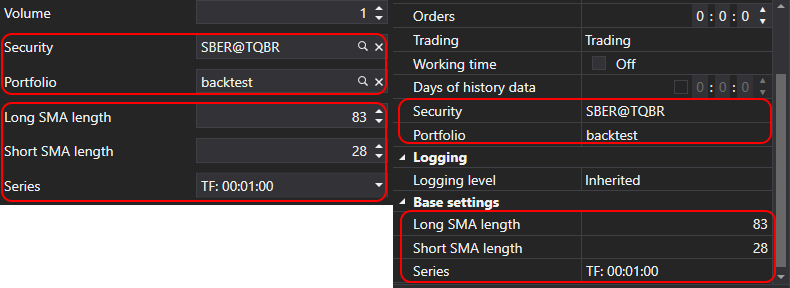

# Strategy Parameters

For strategy configuration and optimization, StockSharp provides a special class [StrategyParam\<T\>](xref:StockSharp.Algo.Strategies.StrategyParam`1). Strategy parameters allow you to modify trading algorithm settings without changing the code, which is particularly convenient when switching between testing and live trading modes. Additionally, these parameters are used during optimization to automatically iterate through values and find optimal strategy settings.

Unlike regular C# properties, parameters created with this class are automatically displayed in visual settings (for example, in Designer) and can be used for strategy optimization.

## Creating Strategy Parameters

Parameters are created in the strategy constructor using the [Strategy.Param](xref:StockSharp.Algo.Strategies.Strategy.Param``1(System.String,``0)) method:

```cs
public class SmaStrategy : Strategy
{
    private readonly StrategyParam<int> _longSmaLength;

    public int LongSmaLength
    {
        get => _longSmaLength.Value;
        set => _longSmaLength.Value = value;
    }

    public SmaStrategy()
    {
        _longSmaLength = Param(nameof(LongSmaLength), 80)
                          .SetGreaterThanZero()
                          .SetDisplay("Long SMA length", string.Empty, "Base settings");
    }
}
```

In this example, a parameter `LongSmaLength` is created with an initial value of 80, a validator is set to ensure the value is greater than zero, and display settings are configured for the user interface.

## Parameter Configuration Methods

The [StrategyParam\<T\>](xref:StockSharp.Algo.Strategies.StrategyParam`1) class provides several methods for parameter configuration:

### SetDisplay

The [StrategyParam\<T\>.SetDisplay](xref:StockSharp.Algo.Strategies.StrategyParam`1.SetDisplay(System.String,System.String,System.String)) method sets the display name, description, and category of the parameter:

```cs
_longSmaLength = Param(nameof(LongSmaLength), 80)
                  .SetDisplay("Long SMA length", "Period of the long moving average", "Base settings");
```

### SetValidator

The [StrategyParam\<T\>.SetValidator](xref:Ecng.ComponentModel.Extensions.SetValidator``1(``0,System.ComponentModel.DataAnnotations.ValidationAttribute)) method sets a validator to check the parameter value. StockSharp provides a range of predefined validators that can be used for the most common tasks:

```cs
// Check that the number is greater than zero
_longSmaLength = Param(nameof(LongSmaLength), 80)
                  .SetValidator(new IntGreaterThanZeroAttribute());

// Check that the number is not negative
_volume = Param(nameof(Volume), 1)
           .SetValidator(new DecimalNotNegativeAttribute());

// Check for value range
_percentage = Param(nameof(Percentage), 50)
               .SetValidator(new RangeAttribute(0, 100));

// Check for required value
_security = Param<Security>(nameof(Security))
             .SetValidator(new RequiredAttribute());
```

For convenience, [StrategyParam\<T\>](xref:StockSharp.Algo.Strategies.StrategyParam`1) has built-in methods for the most common validators:

```cs
// Check that the number is greater than zero
_longSmaLength = Param(nameof(LongSmaLength), 80).SetGreaterThanZero();

// Check that the number is not negative
_volume = Param(nameof(Volume), 1).SetNotNegative();

// Check that the value is NULL or not negative
_interval = Param<TimeSpan?>(nameof(Interval)).SetNullOrNotNegative();

// Set value range
_percentage = Param(nameof(Percentage), 50).SetRange(0, 100);
```

If the built-in validators are not sufficient, you can create your own by inheriting from [ValidationAttribute](https://docs.microsoft.com/en-us/dotnet/api/system.componentmodel.dataannotations.validationattribute):

```cs
public class EvenNumberAttribute : ValidationAttribute
{
    public EvenNumberAttribute()
        : base("Value must be an even number.")
    {
    }

    public override bool IsValid(object value)
    {
        if (value is int intValue)
            return intValue % 2 == 0;
        
        return false;
    }
}

// Using custom validator
_barCount = Param(nameof(BarCount), 10)
             .SetValidator(new EvenNumberAttribute());
```

### SetHidden

The [StrategyParam\<T\>.SetHidden](xref:StockSharp.Algo.Strategies.StrategyParam`1.SetHidden(System.Boolean)) method hides the parameter in the property editor:

```cs
_systemParam = Param(nameof(SystemParam), "value")
                .SetHidden(true);
```

### SetBasic

The [StrategyParam\<T\>.SetBasic](xref:StockSharp.Algo.Strategies.StrategyParam`1.SetBasic(System.Boolean)) method marks the parameter as basic, which affects its display in the user interface. Basic parameters are displayed in the simplified property editor mode:

```cs
_longSmaLength = Param(nameof(LongSmaLength), 80)
                  .SetBasic(true);
```



### SetReadOnly

The [StrategyParam\<T\>.SetReadOnly](xref:StockSharp.Algo.Strategies.StrategyParam`1.SetReadOnly(System.Boolean)) method makes the parameter read-only:

```cs
_calculatedParam = Param(nameof(CalculatedParam), 0)
                    .SetReadOnly(true);
```

### SetCanOptimize and SetOptimize

The methods [StrategyParam\<T\>.SetCanOptimize](xref:StockSharp.Algo.Strategies.StrategyParam`1.SetCanOptimize(System.Boolean)) and [StrategyParam\<T\>.SetOptimize](xref:StockSharp.Algo.Strategies.StrategyParam`1.SetOptimize(`0,`0,`0)) specify whether the parameter can be used for optimization, and set the range of values for optimization:

```cs
_longSmaLength = Param(nameof(LongSmaLength), 80)
                  .SetCanOptimize(true)
                  .SetOptimize(10, 200, 10);
```

In the example above, the parameter will be optimized in the range from 10 to 200 with a step of 10.

## Using Parameters in Strategy

Strategy parameters are used like regular properties:

```cs
protected override void OnStarted(DateTimeOffset time)
{
    base.OnStarted(time);

    _shortSma = new SimpleMovingAverage { Length = ShortSmaLength };
    _longSma = new SimpleMovingAverage { Length = LongSmaLength };
    
    // ...
}
```

## Saving and Loading Parameters

Parameter values are automatically saved and loaded in the base [Strategy](xref:StockSharp.Algo.Strategies.Strategy) class. When overriding the [Strategy.Save](xref:StockSharp.Algo.Strategies.Strategy.Save(Ecng.Serialization.SettingsStorage)) and [Strategy.Load](xref:StockSharp.Algo.Strategies.Strategy.Load(Ecng.Serialization.SettingsStorage)) methods, you must call the base class methods:

```cs
public override void Save(SettingsStorage settings)
{
    base.Save(settings);
    
    // Additional saving logic...
}

public override void Load(SettingsStorage settings)
{
    base.Load(settings);
    
    // Additional loading logic...
}
```

## Example: Strategy with Multiple Parameters

Below is an example of a strategy with multiple parameters:

```cs
public class SmaStrategy : Strategy
{
    private readonly StrategyParam<DataType> _series;
    private readonly StrategyParam<int> _longSmaLength;
    private readonly StrategyParam<int> _shortSmaLength;

    public DataType Series
    {
        get => _series.Value;
        set => _series.Value = value;
    }

    public int LongSmaLength
    {
        get => _longSmaLength.Value;
        set => _longSmaLength.Value = value;
    }

    public int ShortSmaLength
    {
        get => _shortSmaLength.Value;
        set => _shortSmaLength.Value = value;
    }

    public SmaStrategy()
    {
        base.Name = "SMA strategy";

        Param("TypeId", GetType().GetTypeName(false)).SetHidden();
        _longSmaLength = Param(nameof(LongSmaLength), 80)
                          .SetGreaterThanZero()
                          .SetDisplay("Long SMA length", string.Empty, "Base settings")
                          .SetCanOptimize(true)
                          .SetOptimize(20, 200, 10);
        
        _shortSmaLength = Param(nameof(ShortSmaLength), 30)
                          .SetGreaterThanZero()
                          .SetDisplay("Short SMA length", string.Empty, "Base settings")
                          .SetCanOptimize(true)
                          .SetOptimize(5, 50, 5);
        
        _series = Param(nameof(Series), DataType.TimeFrame(TimeSpan.FromMinutes(15)))
                 .SetDisplay("Series", string.Empty, "Base settings");
    }

    // ...
}
```

In this example, we created a strategy based on crossing two moving averages with three configurable parameters:
- `Series` - data type and timeframe
- `LongSmaLength` - period of the long moving average
- `ShortSmaLength` - period of the short moving average

For the two numeric parameters, we configured optimization capabilities with specified ranges.

## See Also

[Saving and Loading Settings](settings_saving_and_loading.md)
