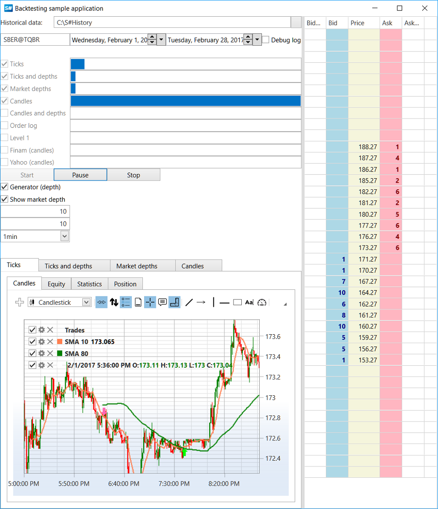

# Historical Testing

Testing on historical data allows both market analysis to find patterns and [optimization of strategy parameters](optimization.md). All work is encapsulated in the [HistoryEmulationConnector](xref:StockSharp.Algo.Testing.HistoryEmulationConnector) class (see more about [testing settings](extended_settings.md)), which receives data saved in local storage through a special [API](../market_data_storage/api.md).

Testing is conducted using tick trades ([Trade](xref:StockSharp.BusinessEntities.Trade)) and order books ([MarketDepth](xref:StockSharp.BusinessEntities.MarketDepth)). If there are no saved order books for a historical period, they can be generated based on trades using [MarketDepthGenerator](xref:StockSharp.Algo.Testing.MarketDepthGenerator) or reconstructed from the order log using [OrderLogMarketDepthBuilder](xref:StockSharp.Algo.Testing.OrderLogMarketDepthBuilder).

Data for historical testing must be downloaded and saved in a special [S#](../../api.md) format in advance. This can be done independently using [Connectors](../connectors.md) and [Storage API](../market_data_storage/api.md), or by setting up and running the special [Hydra](../../hydra.md) program.

The [S#](../../api.md) distribution includes the SampleHistoryTesting example (as well as the HistoryData.zip archive with historical data on ticks, order books, and candles for demonstration), which tests the [Moving Average](https://en.wikipedia.org/wiki/Moving_average) strategy on historical data. For comparison of speed and quality, testing is conducted with different sets of market data:



## Main Stages of Historical Testing

### 1. Setting Up the Data Storage

The first step is to create an [IStorageRegistry](xref:StockSharp.Algo.Storages.IStorageRegistry) object, through which [HistoryEmulationConnector](xref:StockSharp.Algo.Testing.HistoryEmulationConnector) will receive historical data:

```csharp
// Storage that will provide access to tick and quote database
var storageRegistry = new StorageRegistry
{
    // set historical path
    DefaultDrive = new LocalMarketDataDrive(HistoryPath.Folder)
};
```

> [!CAUTION]
> The [LocalMarketDataDrive](xref:StockSharp.Algo.Storages.LocalMarketDataDrive) constructor takes a path to a directory containing history for **all instruments**, not to a directory with a specific instrument. For example, if the HistoryData.zip archive was extracted to the *C:\\R\\RIZ2@FORTS\\* directory, then you must pass the path *C:\\* to [LocalMarketDataDrive](xref:StockSharp.Algo.Storages.LocalMarketDataDrive). For more details, see the [API](../market_data_storage/api.md) section.

### 2. Creating Instruments and Portfolios

```csharp
// create a test instrument for testing
var security = new Security
{
    Id = SecId.Text, // sec id has the same name as folder with historical data
    Code = secCode,
    Board = board,
};

// test portfolio
var portfolio = new Portfolio
{
    Name = "test account",
    BeginValue = 1000000,
};
```

### 3. Creating an Emulation Connector

```csharp
// create a gateway for emulation
var connector = new HistoryEmulationConnector(
    new[] { security },
    new[] { portfolio })
{
    EmulationAdapter =
    {
        Emulator =
        {
            Settings =
            {
                // match order if historical price touched our limit order price. 
                // It is turned off, and price should go through limit order price level
                // (more "severe" test mode)
                MatchOnTouch = false,
                
                // commission for trades
                CommissionRules = new ICommissionRule[]
                {
                    new CommissionPerTradeRule { Value = 0.01m },
                }
            }
        }
    },
    UseExternalCandleSource = emulationInfo.UseCandle != null,
    CreateDepthFromOrdersLog = emulationInfo.UseOrderLog,
    CreateTradesFromOrdersLog = emulationInfo.UseOrderLog,
    HistoryMessageAdapter =
    {
        StorageRegistry = storageRegistry,
        // set history range
        StartDate = startTime,
        StopDate = stopTime,
        OrderLogMarketDepthBuilders =
        {
            {
                secId,
                LocalizedStrings.ActiveLanguage == Languages.Russian
                    ? (IOrderLogMarketDepthBuilder)new PlazaOrderLogMarketDepthBuilder(secId)
                    : new ItchOrderLogMarketDepthBuilder(secId)
            }
        }
    },
    // set market time freq as time frame
    MarketTimeChangedInterval = timeFrame,
};
```

### 4. Subscribing to Events and Setting Up Data Generation

In the new security event, we set the initial Level1 values, register the order book or create and configure an order book generator. Also, depending on the settings, we register to receive the order log and trades:

```csharp
connector.NewSecurity += s =>
{
    if (s != security)
        return;
        
    // fill level1 values
    connector.HistoryMessageAdapter.SendOutMessage(level1Info);
    
    // subscribe to necessary data based on testing settings
    if (emulationInfo.UseMarketDepth)
    {
        connector.Subscribe(new(DataType.MarketDepth, security));
        
        // if order book generation is needed
        if (generateDepths || emulationInfo.UseCandle != null)
        {
            // if no have order book historical data, but strategy is required,
            // use generator based on last prices
            connector.MarketDataAdapter.SendInMessage(new GeneratorMessage
            {
                IsSubscribe = true,
                Generator = new RandomWalkTradeGenerator(new SecurityId { SecurityCode = security.Code })
                {
                    Interval = TimeSpan.FromSeconds(1),
                    MaxVolume = maxVolume,
                    MaxPriceStepCount = 3,    
                    GenerateOriginSide = true,
                    MinVolume = minVolume,
                    RandomArrayLength = 99,
                }
            });
        }
    }
    
    if (emulationInfo.UseOrderLog)
    {
        connector.Subscribe(new(DataType.OrderLog, security));
    }
    
    if (emulationInfo.UseTicks)
    {
        connector.Subscribe(new(DataType.Ticks, security));
    }
    
    if (emulationInfo.UseLevel1)
    {
        connector.Subscribe(new(DataType.Level1, security));
    }
    
    // start strategy before emulation started
    strategy.Start();
    
    // create and subscribe to a candle series
    _series = new CandleSeries(typeof(TimeFrameCandle), security, timeFrame);
    connector.SubscribeCandles(series);
    
    // start historical data loading when connection established successfully and all data subscribed
    connector.Start();
};
```

### 5. Creating and Configuring the Strategy

```csharp
// create a trading strategy, moving averages for 80 5-minute and 10 5-minute candles
var strategy = new SmaStrategy(chart, _candlesElem, _tradesElem, _shortMa, _shortElem, _longMa, _longElem, _series)
{
    Volume = 1,
    Portfolio = portfolio,
    Security = security,
    Connector = connector,
    LogLevel = DebugLogCheckBox.IsChecked == true ? LogLevels.Debug : LogLevels.Info,
    // by default interval is 1 min,
    // it is excessively for time range with several months
    UnrealizedPnLInterval = ((stopTime - startTime).Ticks / 1000).To<TimeSpan>()
};
```

### 6. Visualizing Results

To visualize testing results, you can subscribe to changes in P&L and position:

```csharp
// copy parameters to the visual panel
statistic.Parameters.Clear();
statistic.Parameters.AddRange(strategy.StatisticManager.Parameters);

var equity = set.Item6;
var pnlCurve = equity.CreateCurve(LocalizedStrings.PnL + " " + emulationInfo.StrategyName, emulationInfo.CurveColor, ChartIndicatorDrawStyles.Area);
var unrealizedPnLCurve = equity.CreateCurve(LocalizedStrings.PnLUnreal + emulationInfo.StrategyName, Colors.Black, ChartIndicatorDrawStyles.Line);
var commissionCurve = equity.CreateCurve(LocalizedStrings.Str159 + " " + emulationInfo.StrategyName, Colors.Red, ChartIndicatorDrawStyles.DashedLine);
var posItems = set.Item7.CreateCurve(emulationInfo.StrategyName, emulationInfo.CurveColor, ChartIndicatorDrawStyles.Line);

strategy.PnLChanged += () =>
{
    var pnl = new EquityData
    {
        Time = strategy.CurrentTime,
        Value = strategy.PnL - strategy.Commission ?? 0
    };
    var unrealizedPnL = new EquityData
    {
        Time = strategy.CurrentTime,
        Value = strategy.PnLManager.UnrealizedPnL ?? 0
    };
    var commission = new EquityData
    {
        Time = strategy.CurrentTime,
        Value = strategy.Commission ?? 0
    };
    
    pnlCurve.Add(pnl);
    unrealizedPnLCurve.Add(unrealizedPnL);
    commissionCurve.Add(commission);
};

strategy.PositionChanged += () => posItems.Add(new EquityData { Time = strategy.CurrentTime, Value = strategy.Position });
```

### 7. Starting the Test

```csharp
// start emulation
connector.Connect();
```

## Modernized Historical Testing Example

In the latest versions of [S#](../../api.md), the historical testing example has been modernized and now allows testing a strategy using different types of data:

- Ticks
- Order books
- Candles of various timeframes
- Order log
- Level1
- Combinations of different data types

A separate tab with charts and statistics is created for each data type:

```csharp
// create backtesting modes
_settings = new[]
{
    (
        TicksCheckBox,
        TicksProgress,
        TicksParameterGrid,
        // ticks
        new EmulationInfo
        {
            UseTicks = true,
            CurveColor = Colors.DarkGreen,
            StrategyName = LocalizedStrings.Ticks
        },
        TicksChart,
        TicksEquity,
        TicksPosition
    ),

    (
        TicksAndDepthsCheckBox,
        TicksAndDepthsProgress,
        TicksAndDepthsParameterGrid,
        // ticks + order book
        new EmulationInfo
        {
            UseTicks = true,
            UseMarketDepth = true,
            CurveColor = Colors.Red,
            StrategyName = LocalizedStrings.TicksAndDepths
        },
        TicksAndDepthsChart,
        TicksAndDepthsEquity,
        TicksAndDepthsPosition
    ),
    
    // ... other data type combinations
};
```

This approach makes it easy to compare the strategy's performance with different data sources.

## Advanced Testing Settings

For more details on additional testing settings, including configuring order book generators, order execution delays, and other parameters, see the [Testing Settings](extended_settings.md) section.