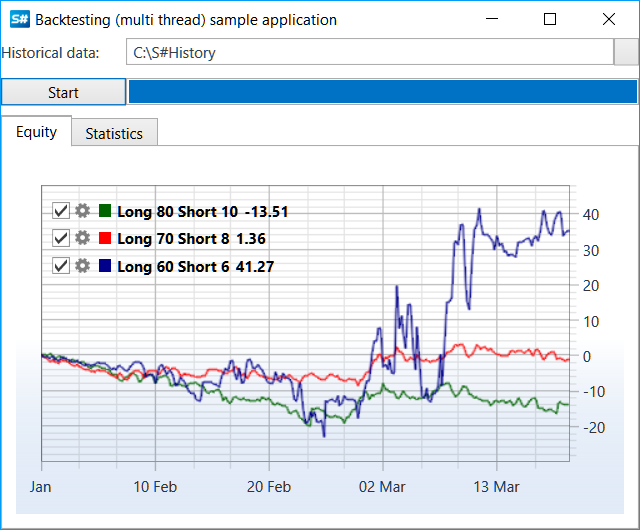

# Optimization

To optimize the [backtesting](historical_data.md) process it is possible to use parallel computation based on multiple threads. On computers with multiple cores or processors this will reduce the overall testing time due concurrent execution of multiple operations. 

> [!CAUTION]
> Using multiple threads increases the memory consumption (approximately as many times as threads created, if each thread uses its time range in the history). Therefore, the use of parallel testing without sufficient memory, will not allow a significant increase in performance, and even reduce it. 

## Example of moving averages strategy testing in several threads

1. The SampleHistoryTesting example, described in the [Historical data](historical_data.md) testing section, is taken as the basis. This example is a modified conventional testing for testing with optimization through fitting of the optimum value of the moving averages lengths: 
2. Creating a few settings of the moving averages lengths (the first value is responsible for the length of the longest, the second for the length of the shortest, and the third for the equity curve color): 

   ```cs
   var periods = new[]
   {
   	new Tuple<int, int, Color>(80, 10, Colors.DarkGreen),
   	new Tuple<int, int, Color>(70, 8, Colors.Red),
   	new Tuple<int, int, Color>(60, 6, Colors.DarkBlue)
   };
   ```
3. Creating an instance of the storage, the instrument, the message to set the values of Level1 and the portfolio: 

   ```cs
   					
   // storage to historical data
   var storageRegistry = new StorageRegistry
   {
   	// set historical path
   	DefaultDrive = new LocalMarketDataDrive(HistoryPath.Folder)
   };
   var timeFrame = TimeSpan.FromMinutes(5);
   // create test security
   var security = new Security
   {
   	Id = "ESM2@NYSE", // sec id has the same name as folder with historical data
   	Code = "ESM2",
   	Name = "ES-12.12",
   	Board = ExchangeBoard.Nyse,
   };
   var startTime = new DateTime(2012, 10, 1);
   var stopTime = new DateTime(2012, 10, 31);
   var level1Info = new Level1ChangeMessage
   {
   	SecurityId = security.ToSecurityId(),
   	ServerTime = startTime,
   }
   .TryAdd(Level1Fields.PriceStep, 10m)
   .TryAdd(Level1Fields.StepPrice, 6m)
   .TryAdd(Level1Fields.MinPrice, 10m)
   .TryAdd(Level1Fields.MaxPrice, 1000000m)
   .TryAdd(Level1Fields.MarginBuy, 10000m)
   .TryAdd(Level1Fields.MarginSell, 10000m);
   // test portfolio
   var portfolio = new Portfolio
   {
   	Name = "test account",
   	BeginValue = 1000000,
   };
   ```
4. Creating a unified connector [BatchEmulation](xref:StockSharp.Algo.Strategies.Testing.BatchEmulation), which will contain all created in the next step [HistoryEmulationConnector](xref:StockSharp.Algo.Testing.HistoryEmulationConnector): 

   ```cs
   // create backtesting connector
   var batchEmulation = new BatchEmulation(new[] { security }, new[] { portfolio }, storageRegistry)
   {
   	EmulationSettings =
   	{
   		MarketTimeChangedInterval = timeFrame,
   		StartTime = startTime,
   		StopTime = stopTime,
   		// count of parallel testing strategies
   		BatchSize = periods.Length,
   	}
   };
   ```
5. Next, the subscription to the unified gateway and the connector events is performed, testing parameters are configured, as well as the strategy is created for each period. 

   ```cs
   // handle historical time for update ProgressBar
   batchEmulation.ProgressChanged += (curr, total) => this.GuiAsync(() => TestingProcess.Value = total);
   batchEmulation.StateChanged += (oldState, newState) =>
   {
   	if (batchEmulation.State != EmulationStates.Stopped)
   		return;
   	this.GuiAsync(() =>
   	{
   		if (batchEmulation.IsFinished)
   		{
   			TestingProcess.Value = TestingProcess.Maximum;
   			MessageBox.Show(this, LocalizedStrings.Str3024.Put(DateTime.Now - _startEmulationTime));
   		}
   		else
   			MessageBox.Show(this, LocalizedStrings.cancelled);
   	});
   };
   // get emulation connector
   var connector = batchEmulation.EmulationConnector;
   logManager.Sources.Add(connector);
   connector.NewSecurity += s =>
   {
   	if (s != security)
   		return;
   	// fill level1 values
   	connector.SendInMessage(level1Info);
   	connector.MarketDataAdapter.SendInMessage(new GeneratorMessage
   	{
   		IsSubscribe = true,
   		Generator = new RandomWalkTradeGenerator(new SecurityId { SecurityCode = security.Code })
   		{
   			Interval = TimeSpan.FromSeconds(1),
   			MaxVolume = maxVolume,
   			MaxPriceStepCount = 3,	
   			GenerateOriginSide = true,
   			MinVolume = minVolume,
   			RandomArrayLength = 99,
   		}
   	});				
   };
   TestingProcess.Maximum = 100;
   TestingProcess.Value = 0;
   _startEmulationTime = DateTime.Now;
   var strategies = periods
   	.Select(period =>
   	{
   		...
       
   		// create strategy based SMA
   		var strategy = new SmaStrategy(series, new SimpleMovingAverage { Length = period.Item1 }, new SimpleMovingAverage { Length = period.Item2 })
   		{
   			Volume = 1,
   			Security = security,
   			Portfolio = portfolio,
   			Connector = connector,
   			// by default interval is 1 min,
   			// it is excessively for time range with several months
   			UnrealizedPnLInterval = ((stopTime - startTime).Ticks / 1000).To<TimeSpan>()
   		};
   		...
       var curveItems = Curve.CreateCurve(LocalizedStrings.Str3026Params.Put(period.Item1, period.Item2), period.Item3, DrawStyles.Line);
   		strategy.PnLChanged += () =>
   		{
   			var data = new EquityData
   			{
   				Time = strategy.CurrentTime,
   				Value = strategy.PnL,
   			};
   			this.GuiAsync(() => curveItems.Add(data));
   		};
   		Stat.AddStrategies(new[] { strategy });
   		return strategy;
   	});
   ```
6. The testing starts: 

   ```cs
   // start emulation
   batchEmulation.Start(strategies, periods.Length);
   ```
