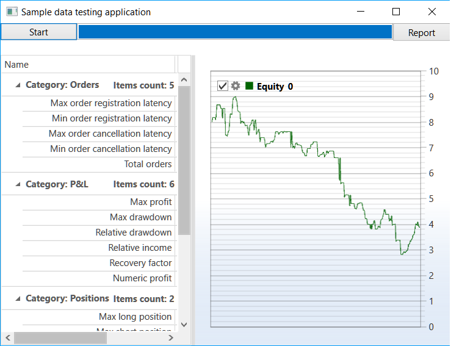

# Random data

Testing on random data is a special kind of testing. It is not intended to search for the optimal parameters. Instead, such testing can detect errors in the code by exposing the trading algorithm to various exchange scenarios. 

As a rule, only a certain set of scenarios is used in the algorithm development. Therefore, when there is a special situation, the algorithm may not react right or throw exceptions. For example, the following situations may occur: 

- The strategy works with the [TimeFrameCandleMessage](xref:StockSharp.Messages.TimeFrameCandleMessage) candles and expects at each iteration, that there will always be a candle for the requested period of time. A period began when there was not a single trade, and a candle was not created. As a result, in the absence of proper handling, the [NullReferenceException](xref:System.NullReferenceException) will be thrown and the strategy will stop. 
- The strategy works with non\-liquid instrument and uses [IOrderBookMessage](xref:StockSharp.Messages.IOrderBookMessage). The strategy expects that the order book is always filled. At some time, the order book is half filled (for example, there are bids, but no offers). If the strategy does not expect this situation, then either it will register an order incorrectly, or it will throw an exception and the strategy will stop. 
- The strategy calculates the price levels. The code is written in such a way that the strategy awaits when levels set in advance will be broken through. If the levels are calculated and are set not correctly, then they will never be broken through, or always only one of them will be broken through. As a result, either the strategy will not perform any trades, or these trades will lose money. 

For these and for many other scenarios of the exchange work, which is impossible to predict in advance, the [S\#](../../api.md) provides testing on random data, which will be able to generate the maximum number of conditions at the short range due to its uniform uniqueness. 

## Testing on random data of moving averages strategy

1. The SampleRandomEmulation example (*..Samples\/Testing\/SampleRandomEmulation*) is almost identical to the SampleHistoryTesting example (its description can be found in the [testing on historical data](historical_data.md) section) due to the use of the unified [HistoryEmulationConnector](xref:StockSharp.Algo.Testing.HistoryEmulationConnector) class. But, unlike the [testing on historical data](historical_data.md), testing on random data the market data are not loaded and are generated "on the fly". Therefore, two random data generators are added to the example: for the order book and for the tick trades. In SampleHistoryTesting only one generator is used \- for the order book, as there is no history stored. 

   ```cs
   _connector.MarketDataAdapter.SendInMessage(new GeneratorMessage
   {
       IsSubscribe = true,
       Generator = new RandomWalkTradeGenerator(new SecurityId { SecurityCode = security.Code })
       {
           Interval = TimeSpan.FromSeconds(1),
           MaxVolume = maxVolume,
           MaxPriceStepCount = 3,	
           GenerateOriginSide = true,
           MinVolume = minVolume,
           RandomArrayLength = 99,
       }
   });
   _connector.SubscribeMarketDepth(new TrendMarketDepthGenerator(_connector.GetSecurityId(security)) { GenerateDepthOnEachTrade = false });
   ```
2. The result of the example work is as follows: 
