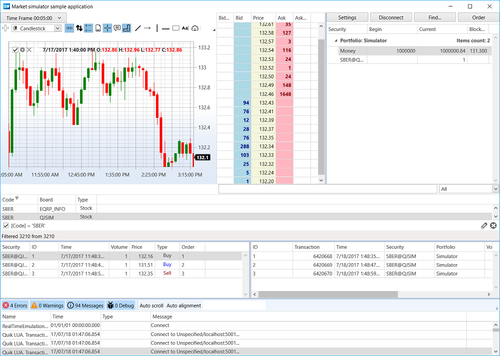

# Real-Time Market Data Testing

Real-time market data testing involves trading with an actual connection to the exchange ("live" quotes), but without placing real orders on the exchange. All registered orders are intercepted, and their execution is emulated based on market order books. Such testing can be useful, for example, when developing a trading simulator, or when checking a trading algorithm over a short period with real quotes.

To emulate trading with real data, you need to use [RealTimeEmulationTrader\<TAdapter\>](xref:StockSharp.Algo.Testing.RealTimeEmulationTrader`1), which acts as a "wrapper" for a specific trading system connector ([Binance](../connectors/crypto_exchanges/binance.md), [Tinkoff](../connectors/russia/tinkoff.md), etc.).

## Creating an Emulation Connector

To create an emulation connector, first create a regular connector to receive market data, and then create an emulation connector based on it:

```csharp
// Create a regular connector for receiving market data
private readonly Connector _realConnector = new();

// Create an emulation connector
_emuConnector = new RealTimeEmulationTrader<IMessageAdapter>(_realConnector.Adapter, _realConnector, _emuPf, false);

// Configure emulation parameters
var settings = _emuConnector.EmulationAdapter.Emulator.Settings;
settings.TimeZone = TimeHelper.Est;
settings.ConvertTime = true;
```

For trade emulation, you need to use a special portfolio:

```csharp
private readonly Portfolio _emuPf = Portfolio.CreateSimulator();
```

## Subscribing to Events

Like a regular connector, the emulation connector generates events when receiving market data and executing transactions:

```csharp
// Subscribe to connector events
_emuConnector.Connected += () =>
{
	// update gui labels
	this.GuiAsync(() => { ChangeConnectStatus(true); });
};

_emuConnector.Disconnected += () =>
{
	// update gui labels
	this.GuiAsync(() => { ChangeConnectStatus(false); });
};

_emuConnector.ConnectionError += error => this.GuiAsync(() =>
{
	// update gui labels
	ChangeConnectStatus(false);
	MessageBox.Show(this, error.ToString(), LocalizedStrings.ErrorConnection);
});

_emuConnector.OrderBookReceived += OnDepth;
_emuConnector.PositionReceived += (sub, p) => PortfolioGrid.Positions.TryAdd(p);
_emuConnector.OwnTradeReceived += (s, t) => TradeGrid.Trades.TryAdd(t);
_emuConnector.OrderReceived += (s, o) =>
{
	if (!_fistTimeOrders.Add(o))
		return;

	_bufferOrders.Add(o);
	OrderGrid.Orders.Add(o);
};

// Subscribe to order registration errors
_emuConnector.OrderRegisterFailReceived += (s, f) => OrderGrid.AddRegistrationFail(f);

_emuConnector.CandleReceived += (s, candle) =>
{
	if (s == _candlesSubscription)
		_buffer.Add(candle);
};
```

## Subscribing to Market Data

To work with market data, you need to subscribe to the appropriate data types:

```csharp
// Subscribe to order books, ticks, and Level1 for the emulation connector
_emuConnector.Subscribe(new(DataType.MarketDepth, security));
_emuConnector.Subscribe(new(DataType.Ticks, security));
_emuConnector.Subscribe(new(DataType.Level1, security));

// Subscribe to order books for the real connector (needed for emulation)
_realConnector.Subscribe(new(DataType.MarketDepth, security));

// Subscribe to candles
_candlesSubscription = new(CandleDataTypeEdit.DataType, security)
{
	From = DateTimeOffset.UtcNow - TimeSpan.FromDays(10),
};
_emuConnector.Subscribe(_candlesSubscription);
```

## Order Registration and Management

Orders are registered through the emulation connector similar to a regular connector:

```csharp
// Order registration
_emuConnector.RegisterOrder(order);

// Order cancellation
_emuConnector.CancelOrder(order);

// Order replacement
_emuConnector.ReRegisterOrder(order, newPrice, order.Balance);
```

## Configuring Emulation Parameters

You can use the [MarketEmulatorSettings](xref:StockSharp.Algo.Testing.MarketEmulatorSettings) property to configure emulation parameters:

```csharp
var settings = _emuConnector.EmulationAdapter.Emulator.Settings;

// Set timezone
settings.TimeZone = TimeHelper.Est;

// Convert time
settings.ConvertTime = true;

// Match orders on price touch
settings.MatchOnTouch = false;

// Emulate order execution latency
settings.Latency = TimeSpan.FromMilliseconds(100);
```

## Interface Example

The SampleRealTimeEmulation example demonstrates the ability to simultaneously display data from both the real connector and the emulation connector:



The application interface contains the following elements:
- Charts for displaying candles and orders
- Order and own trade tables
- Real market and emulation order books
- Controls for creating and canceling orders

## Advantages and Limitations

Real-time market data testing has the following advantages:
- Using real market data without financial risks
- Testing algorithms in conditions very close to real trading
- Ability to compare results with the real market in real time

Limitations:
- Testing speed is limited by the rate of real data
- Inability to test on historical periods
- Dependence on the quality and completeness of the received market data