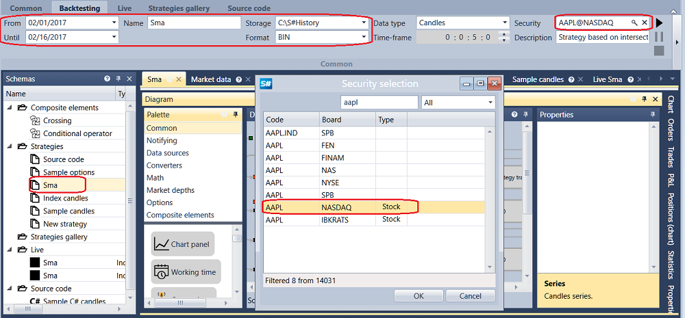
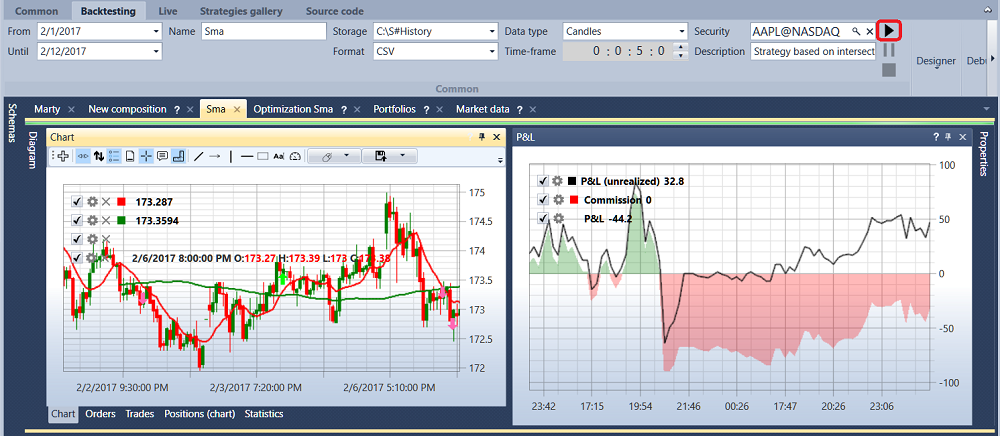

# Quick Start

On first launch, [Designer](../designer.md) opens the preconfigured moving average strategy diagram.

To run it on historical data, you need to download the data in the correct format. We recommend using [Hydra](../hydra.md), a program designed for automatic market-data loading (instruments, candles, tick trades, order books, and other data) from different sources and storing it in local storage. Historical data download and storage are described in detail in [Market data storage](market_data_storage.md).

After the data is downloaded with [Hydra](../hydra.md), specify the directory where [Hydra](../hydra.md) saved the history in [Designer](../designer.md). This is configured on the **Backtest** -> **Storage** tab.

Clicking  opens the **Data storage settings** window, where you can configure local or remote storage. You can also configure [Hydra](../hydra.md) [in server mode](../hydra/server_mode/settings.md) as a market-data source. Clicking ![[Designer_Settings_Repository_button.png]] opens the folder selection window. Select the folder where you previously saved the history downloaded by [Hydra](../hydra.md).

Now get the instruments and their data from the configured local storage. Go to the **Common** tab and select the **Market data** component.

The market-data management tab opens. To get the available instruments, click [Download instruments](market_data_storage/download_instruments.md). To download an instrument, enter its code or select the **All** flag, choose the data source, and click **OK**. [Designer](../designer.md) requests the available instruments from the data source. All found instruments appear in the **All instruments** panel.

Now [Designer](../designer.md) can use the downloaded instruments and historical data available in storage. Choose one of the demo strategies. In the [Schemas](user_interface/schemas.md) panel, open the **Strategies** folder and double-click the **SMA** sample strategy. The **Sma** tab appears in the workspace. After switching to the strategy, the ribbon automatically opens the **Backtest** tab, which contains the main controls for creating, debugging, and testing strategies ([Creating strategies](strategies/using_visual_designer.md), [Historical testing example](backtesting/getting_started.md)).

On the **Backtest** tab, set the testing period, select the instrument, and choose [Market data storage](market_data_storage.md).

Clicking  in the **Instrument** field opens the **Select instrument** window. Select the required instrument in this window.

When you select any block on the **Designer** panel, the **Properties** panel shows that block's properties. In the **Properties** panel of the **Candles** block, you can configure the candle type and Time Frame ([Candles](../api/candles.md)).

After clicking **Start**, trading emulation begins. The test results are available on the corresponding tabs of the diagram: Chart, Orders, Trades, P/L, Positions (chart), Statistics, and Positions.

