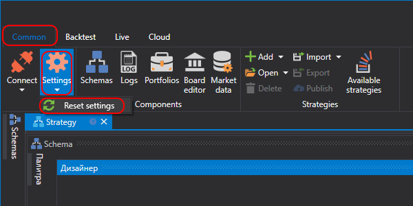

# Reset settings

> [!CAUTION]
> **Before resetting settings, read this section carefully.**

The **Quick access panel** is located at the top of the program window by default and contains the settings button . When you click , you can change the startup mode, change the interface language, or reset all settings.

When you select **Reset settings**, a confirmation window opens.

After you click **OK**, all settings are reset to their default values. The program settings directory is cleared completely. **All created strategies, downloaded instruments, and other information stored in the settings directory will be deleted.**
