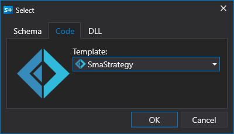
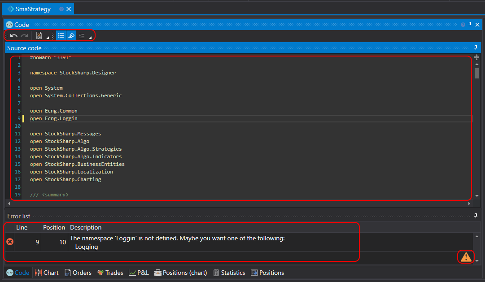

# Using F#

Creating strategies from code is for users who prefer working with F# code. Such strategies are not limited in capabilities unlike diagrams, and any algorithm can be described.

The process of creating a strategy takes place directly in [Designer](../../../designer.md) or a **F#** development environment (the most popular of which are **Visual Studio** and **JetBrains Rider**), using a library for professional development of trading robots in **F#** and [API](../../../api.md).

You can add a new strategy by pressing the **Add**  button on the **Common** tab and choose **Strategy**. Or, by right-clicking on the **Strategies** folder in the **Scheme** panel, and pressing the **Add**  button in the dropdown menu:

After pressing the **Add**  button, a window will appear with a choice of content type to create the strategy on:

To create a strategy from F# code, you need to select the second tab. You can also choose a template that will be used as the initial code.

After pressing **OK**, a new strategy will appear in the **Strategies** folder of the **Scheme** panel, similarly to when creating a strategy from [diagrams](../using_visual_designer.md). And similar actions for deleting or renaming the strategy.

But instead of a diagram, an F# code editor will be displayed:

The code editor tab consists of **Source Code** and **Error List** panels. The **Source Code** panel contains the F# code editor itself. At the top, there is a toolbar where highlighting such things as **Current Line**, **Line Number**, etc., can be turned on or off. To increase the font size, you can use the CTRL+MouseWheel combination.

The **Error List** panel is a table with a list of errors in the code, double-clicking on a line will automatically move the cursor in the **Source Code** panel to the error location.

When editing the code, an icon  will appear in the bottom right corner of the **Error List** panel, indicating that change tracking has begun. The code compiles at the moment when the code stops changing.

Running the strategy on [backtest](../../backtesting/user_interface.md), on [live](../../live_execution/getting_started.md), and other operations are similar to the strategy from diagrams.
