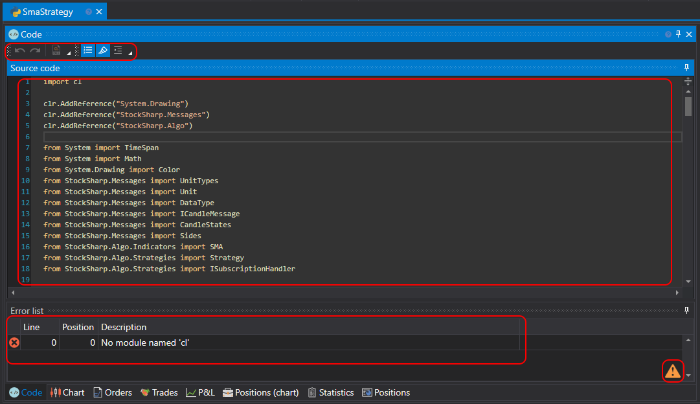

# Using Python

Creating strategies from code is for users who prefer working with Python code. Such strategies are not limited in capabilities unlike schemes, and any algorithm can be implemented.

The strategy creation process takes place directly in [Designer](../../../designer.md) or in a **Python** development environment (the most popular development environments are **Visual Studio** and **JetBrains Rider**), using the library for professional development of trading robots in **Python** and [API](../../../api.md).

You can add a new strategy by clicking the **Add** button  in the **General** tab and selecting **Strategy**. Or by right-clicking on the **Strategies** folder in the **Schemes** panel and clicking the **Add** button  in the dropdown menu:

After clicking the **Add** button , a window will appear with a choice of content type on which to create the strategy:

To create a strategy from Python code, select the second tab. You can also choose a template that will be used as initial code.

After clicking **OK**, a new strategy will appear in the **Strategies** folder of the **Schemes** panel, similar to creating a strategy from a [scheme](../using_visual_designer.md). Actions for deleting or renaming the strategy are also similar.

But instead of a scheme, a Python code editor will be shown:

The code editor tab consists of **Source Code** and **Error List** panels. The **Source Code** panel contains the Python code editor itself. At the top is a toolbar where you can enable or disable highlighting of things like **Current Line**, **Line Number**, etc. To increase the font size, you can use the CTRL+MouseWheel combination.

The **Error List** panel is a table with a list of code errors; double-clicking on a line will automatically move the cursor in the **Source Code** panel to the error location.

When editing code, an icon  will appear in the bottom right corner of the **Error List** panel, indicating that change tracking has begun. Code compilation occurs when the code stops changing.

Running the strategy on [backtest](../../backtesting/user_interface.md), on [live](../../live_execution/getting_started.md), and other operations work similarly to strategies created from schemes.

## Limitations

> [!WARNING]
> [Designer](../../../designer.md) uses IronPython, which has the following limitations:
> - Compatibility with Python version 3.4
> - Partial numpy support through a special .NET implementation (usage example can be found [here](https://github.com/StockSharp/StockSharp/blob/master/Algo.Analytics.Python/pearson_correlation_script.py))
> - Lack of support for other popular libraries written in C (pandas, scipy, etc.)
> - Limited support for asynchronous programming
> - Inability to use certain built-in Python modules due to dependency on CPython-specific implementations
> - Performance may be lower compared to CPython for some operations
>
> It is recommended to consider these limitations when developing trading strategies in Python within [Designer](../../../designer.md).