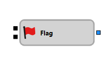

# Flag

The "Flag" component is used to manage a binary flag, which can be set or reset based on incoming signals.

## Input Sockets

- **Trigger**: Accepts any value except `False`. Sets the flag upon receiving the first appropriate value. If the flag is already set, subsequent signals are ignored until it is reset.
- **Reset**: Accepts any value except `False`. Resets the flag, allowing it to respond to subsequent triggers.

## Output Sockets

- **Signal**: Outputs a signal when the flag is set.