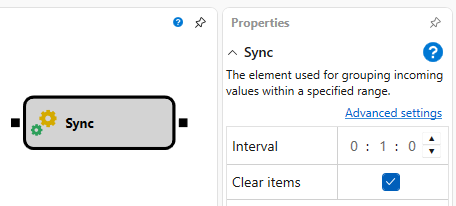
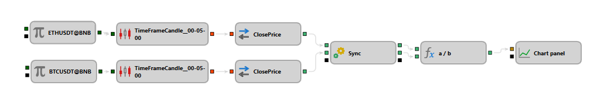

## Synchronization

The Synchronization block is designed to accumulate and synchronize data from various sources (for example, candles from different instruments, different time frames, combinations of candles and transactions) and subsequently issue them when a certain amount is accumulated. This block is useful for creating custom indexes or arbitrage.

## Input Sockets

- **Incoming**: When a new data source is connected, a corresponding outgoing socket and a new incoming socket are automatically created. The number of incoming values is unlimited.

## Parameters

- **Interval**: Sets the time after which data must be updated or deleted. If an incoming value arrives with a time exceeding the previous value plus the interval, old data is cleared, and a new batch of data accumulation begins.
- **Clear items**: If this option is activated, data are cleared after their accumulation for all connected incoming sockets, or data are accumulated until data from the next time interval appears.

## Usage Examples

1. Creating a custom index for multiple stocks, where it is necessary to consider different time series from various data sources.
2. Arbitrage between different markets using synchronized time data to identify temporal price differences.

