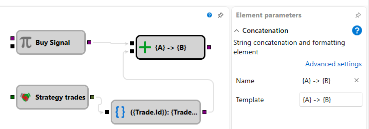

# String concat

The cube concatenates several incoming values into a single text string according to
a template with placeholders in curly braces. Each placeholder name adds an input
socket with the same name. You can reference nested properties through dots and
specify formatting after a colon.

### Incoming sockets

Incoming sockets

- Created dynamically from placeholder names. Each socket accepts data of any type.

### Outgoing sockets

Outgoing sockets

- **Text** – the concatenated and formatted string.

### Parameters

Parameters

- **Template** – string concatenation and formatting template. Editing the template
  updates the list of input sockets.

### Examples

- Template `Price: {price:0.00}, Qty: {qty}` with `price = 10.5` and `qty = 2`
  produces `Price: 10.50, Qty: 2`.
- Template `{time:HH:mm:ss} - {trade.Price}` with sockets `time` and `trade`
  (`trade.Price = 100`) produces `09:15:00 - 100`.
- Template `{side} {volume} @ {trade.Price}` with sockets `side = Buy`,
  `volume = 1`, `trade.Price = 100` produces `Buy 1 @ 100`.

## Recommended content

[String format](string_format.md)
[Notification](notification.md)

