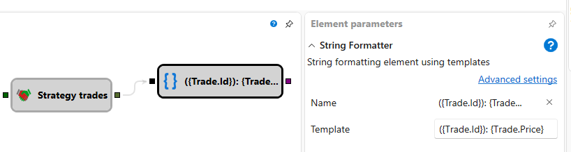

# String format

The cube converts an incoming value of any type into a text string. The
conversion is performed according to a template with placeholders in curly
braces. Each placeholder refers to the whole value (`{0}`) or to one of its
properties (`{Price}`, `{Trade.Price}`, etc.). You can specify a format after a
colon to control how numbers, dates or other objects appear in text.

### Incoming sockets

Incoming sockets

- **Input** – the value to be formatted. The socket accepts data of any type.

### Outgoing sockets

Outgoing sockets

- **Text** – the result of applying the template to the incoming value.

### Parameters

Parameters

- **Template** – string formatting template applied to the incoming value. The
  default template is `{0}`, meaning the value is inserted without additional
  formatting. Placeholders may contain property names and format strings, for
  example `Price: {0:0.00}` or `{Price:0.00}`.

### Examples

- Template `Price: {0:0.00}` with input `10.5` produces `Price: 10.50`.
- Template `{Price} - {Volume}` with input trade object `{ Price = 100,
  Volume = 2 }` produces `100 - 2`.
- Template `{Trade.Price} - {Trade.Volume}` with input object
  `{ Trade = { Price = 100, Volume = 2 } }` produces `100 - 2`.
- Template `Time: {Time:HH:mm:ss}` with input object with `Time =
  2024-05-01T09:15:00` produces `Time: 09:15:00`.

## Recommended content

[String concat](string_concat.md)
[Notification](notification.md)
