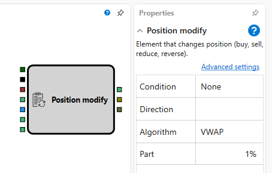

# Modify Position

The "Modify Position" component is used to change a trading position based on specified conditions.

## Input Sockets

- **Security**: The instrument for which the position will be modified.
- **Trigger**: Signal to activate the modification of the position.
- **Portfolio**: The portfolio within which the operation occurs.
- **Volume** (optional): The volume for "Increase" and "Decrease" operations. Not used for "Reverse" and "Close Position".
- **Last Price** and **Last Volume**: For "VWAP" and "Iceberg" algorithms, data about the last price and volume of the transaction are required.
- **Cancel**: Signal to cancel the position setup, for example, due to a timeout.

## Output Sockets

- **Order**: Information about the placed order.
- **Transaction**: Information about the transaction conducted on the order.
- **Balance**: This socket transmits information about the portion of the position that was not realized at the end of the position modification operation. The value returned by the socket indicates the result of the operation:
  - `0` means that the component successfully completed the position modification operation, and all planned actions were executed.
  - `-1` indicates that the component did not start the position modification due to a mismatch of the current position and the specified condition (for example, if the current position is different from zero and the condition was "OpenPosition").
  - Any value greater than `0` signals that the process of modifying the position was interrupted before its completion. This could happen due to cancellation through the scheme logic or an error during order registration.

## Parameters

- **Condition**: Position Modification Conditions:
  - `None`: Performs no actions.
  - `OpenPosition`: Opens a position in the specified direction.
  - `ClosePosition`: Closes the current position.
  - `Decrease`: Reduces the size of the current position.
  - `Increase`: Increases the size of the current position.
  - `Reverse`: Closes the current position and opens a new one in the opposite direction.
- **Direction**: Specifies the direction for "OpenPosition" and "None", and serves as an optional filter for other conditions.
- **Algorithm**: Options include "Market Order", "VWAP", "Iceberg".
- **Part**: The fraction of the total volume that will be divided into smaller segments when using algorithms like "VWAP" or "Iceberg".

If the component receives a trigger while it has already started changing the volume, it ignores the new trigger. If the conditions for modification are incompatible with the current state of the position (for example, attempting to "OpenPosition" when a position is already open), the component immediately returns `-1` through the output socket **Balance**, indicating that the operation is not required and was not started.

## Note

For low-level order management, the [Order Registration](../orders/register.md) component can be used. For higher-level position management, this "Modify Position" component is recommended.

## See Also

- [Order Registration](../orders/register.md)
