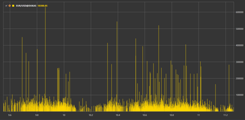

# Creating a Script

**Analytics** allows creating your own scripts. As an example, let's review the **ChartDrawScript**, which demonstrates the capabilities of chart drawing:

```cs
namespace StockSharp.Algo.Analytics
{
	/// <summary>
	/// The analytic script, shows chart drawing possibilities.
	/// </summary>
	public class ChartDrawScript : IAnalyticsScript
	{
		Task IAnalyticsScript.Run(ILogReceiver logs, IAnalyticsPanel panel, SecurityId[] securities, DateTime from, DateTime to, IStorageRegistry storage, IMarketDataDrive drive, StorageFormats format, TimeSpan timeFrame, CancellationToken cancellationToken)
		{
			if (securities.Length == 0)
			{
				logs.AddWarningLog("No instruments.");
				return Task.CompletedTask;
			}

			var lineChart = panel.CreateChart<DateTimeOffset, decimal>();
			var histogramChart = panel.CreateChart<DateTimeOffset, decimal>();

			foreach (var security in securities)
			{
				// stop calculation if user cancel script execution
				if (cancellationToken.IsCancellationRequested)
					break;

				var candlesSeries = new Dictionary<DateTimeOffset, decimal>();
				var volsSeries = new Dictionary<DateTimeOffset, decimal>();

				// get candle storage
				var candleStorage = storage.GetTimeFrameCandleMessageStorage(security, timeFrame, drive, format);

				foreach (var candle in candleStorage.Load(from, to))
				{
					// fill series
					candlesSeries[candle.OpenTime] = candle.ClosePrice;
					volsSeries[candle.OpenTime] = candle.TotalVolume;
				}

				// draw series on chart as line and histogram
				lineChart.Append($"{security} (close)", candlesSeries.Keys, candlesSeries.Values, ChartIndicatorDrawStyles.DashedLine);
				histogramChart.Append($"{security} (vol)", volsSeries.Keys, volsSeries.Values, ChartIndicatorDrawStyles.Histogram);
			}

			return Task.CompletedTask;
		}
	}
}
```

## Overview

This script is designed to draw charts based on the price and volume data of financial instruments over a specific time period. It implements the [IAnalyticsScript](xref:StockSharp.Algo.Analytics.IAnalyticsScript) interface, which defines a contract for any analytical script that can be executed in the **Hydra** program.

## `IAnalyticsScript` Interface

The [IAnalyticsScript](xref:StockSharp.Algo.Analytics.IAnalyticsScript) interface ensures that any implementing analytical script will have the [Run](xref:StockSharp.Algo.Analytics.IAnalyticsScript.Run(Ecng.Logging.ILogReceiver,StockSharp.Algo.Analytics.IAnalyticsPanel,StockSharp.Messages.SecurityId[],System.DateTime,System.DateTime,StockSharp.Algo.Storages.IStorageRegistry,StockSharp.Algo.Storages.IMarketDataDrive,StockSharp.Algo.Storages.StorageFormats,System.TimeSpan,System.Threading.CancellationToken)) method, which is necessary for performing the script's analytical operations.

### `Run` Method

The [Run](xref:StockSharp.Algo.Analytics.IAnalyticsScript.Run(Ecng.Logging.ILogReceiver,StockSharp.Algo.Analytics.IAnalyticsPanel,StockSharp.Messages.SecurityId[],System.DateTime,System.DateTime,StockSharp.Algo.Storages.IStorageRegistry,StockSharp.Algo.Storages.IMarketDataDrive,StockSharp.Algo.Storages.StorageFormats,System.TimeSpan,System.Threading.CancellationToken)) method is the entry point of an analytical script, where actual data processing and analytical operations are performed.

#### Parameters:

- `logs`: Takes an instance of [ILogReceiver](xref:Ecng.Logging.ILogReceiver) for logging within the script.
- `panel`: Provides [IAnalyticsPanel](xref:StockSharp.Algo.Analytics.IAnalyticsPanel), which is a user interface element for drawing charts and displaying results.
- `securities`: An array of [SecurityId](xref:StockSharp.Messages.SecurityId) identifying the financial instruments for analysis.
- `from`: The start date of the data range for analysis.
- `to`: The end date of the data range for analysis.
- `storage`: An instance of [IStorageRegistry](xref:StockSharp.Algo.Storages.IStorageRegistry) allowing access to the market data storage.
- `drive`: Represents [IMarketDataDrive](xref:StockSharp.Algo.Storages.IMarketDataDrive) to specify the location of market data storage.
- `format`: A [StorageFormats](xref:StockSharp.Algo.Storages.StorageFormats) value indicating the market data format.
- `timeFrame`: [TimeSpan](xref:System.TimeSpan) indicating the timeframe for the market data, such as 1 hour or 1 day.
- `cancellationToken`: [CancellationToken](xref:System.Threading.CancellationToken) monitoring for cancellation requests.

#### Returns:

- [Task](xref:System.Threading.Tasks.Task), representing the asynchronous operation of the analytical script.

## Implementation Details

The `ChartDrawScript` class specifically processes market data for each provided security. It creates two types of charts: a line chart for closing prices and a histogram for volume data.

### Main Processing Stages:

1. Check for the presence of instruments to process. If none are available, log a warning and complete the task.
2. Create a line chart and a histogram using the [IAnalyticsPanel.CreateChart](xref:StockSharp.Algo.Analytics.IAnalyticsPanel.CreateChart``2) method.
3. Iterate through each security and check for cancellation requests.
4. Get the candle storage using the `storage.GetTimeFrameCandleMessageStorage` method.
5. Load candle data within the specified date range.
6. Fill dictionaries with open time series data, corresponding closing prices, and total volumes.
7. Draw series data on charts using `lineChart.Append` and `histogramChart.Append` methods.

The script utilizes styles, such as [ChartIndicatorDrawStyles.DashedLine](xref:StockSharp.Charting.ChartIndicatorDrawStyles.DashedLine) for the line chart and [ChartIndicatorDrawStyles.Histogram](xref:StockSharp.Charting.ChartIndicatorDrawStyles.Histogram) for the histogram, to visually distinguish different data presentations.

By implementing [IAnalyticsScript](xref:StockSharp.Algo.Analytics.IAnalyticsScript), the `ChartDrawScript` class enables integrating an approach to executing customizable analytical scripts, making it a versatile tool for traders and analysts using the StockSharp platform.

## Execution Result

