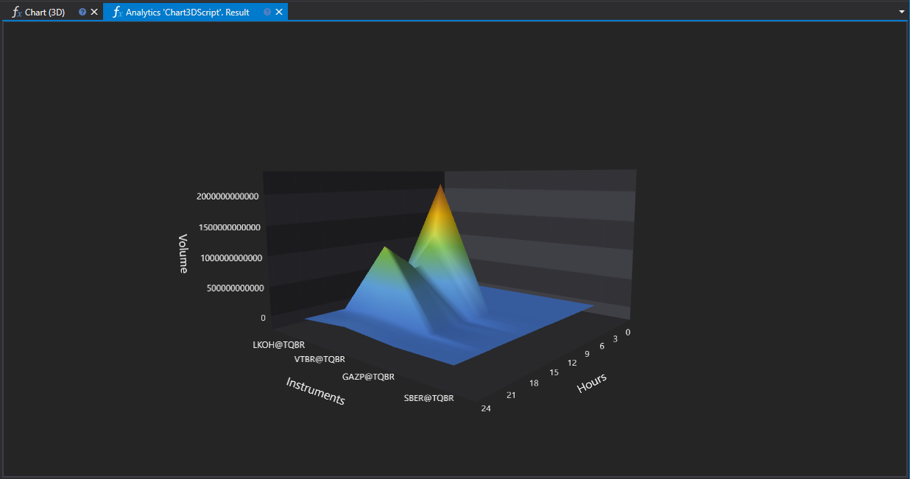

# 3D Chart

The `Chart3DScript` script demonstrates the creation of a 3D chart to visualize the distribution of trading volumes by hour for various financial instruments. This visualization method allows for a clear representation of trading dynamics and identification of market activity peaks.



## Script Operation Description

The script analyzes candle data for the specified period, groups it by hour, and calculates the total trading volume for each hour. The results are presented in a 3D chart, where the axes represent:

- **X-Axis**: Financial instruments.
- **Y-Axis**: Trading session hours (from 0 to 23).
- **Z-Axis**: Trading volumes.

## Usefulness of Using a 3D Chart

### Market Activity Analysis

The 3D chart allows for the assessment of when the greatest activity occurs for multiple instruments simultaneously. This can be useful for identifying optimal trading windows or studying the impact of global events on the market.

### Instrument Comparison

Thanks to the visualization of trading volumes by hour in three-dimensional space, traders can compare instruments against each other in terms of activity level and preferred trading times. This can assist in selecting the most liquid instruments at certain hours or in finding instruments with similar activity patterns for portfolio diversification.

### Strategy Optimization

Analyzing the distribution of trading volumes can serve as a basis for optimizing trading strategies, allowing for adaptation to time frames with the highest market activity. This is particularly relevant for algorithmic and high-frequency trading.

## Script Implementation

The script performs the following actions:

1. Checking for the presence of financial instruments for analysis.
2. Forming labels for the X (instruments) and Y (hours) axes.
3. Loading and grouping candle data.
4. Calculating the total trading volumes by hour and filling in the data for the Z-axis.
5. Drawing the 3D chart using the `panel.Draw3D` method.

## Script Code on C#

```cs
namespace StockSharp.Algo.Analytics
{
	/// <summary>
	/// The analytic script, calculating distribution of the biggest volume by hours
	/// and shows its in 3D chart.
	/// </summary>
	public class Chart3DScript : IAnalyticsScript
	{
		Task IAnalyticsScript.Run(ILogReceiver logs, IAnalyticsPanel panel, SecurityId[] securities, DateTime from, DateTime to, IStorageRegistry storage, IMarketDataDrive drive, StorageFormats format, DataType dataType, CancellationToken cancellationToken)
		{
			if (securities.Length == 0)
			{
				logs.LogWarning("No instruments.");
				return Task.CompletedTask;
			}

			var x = new List<string>();
			var y = new List<string>();

			// fill Y labels
			for (var h = 0; h < 24; h++)
				y.Add(h.ToString());

			var z = new double[securities.Length, y.Count];

			for (var i = 0; i < securities.Length; i++)
			{
				// stop calculation if user cancel script execution
				if (cancellationToken.IsCancellationRequested)
					break;

				var security = securities[i];

				// fill X labels
				x.Add(security.ToStringId());

				// get candle storage
				var candleStorage = storage.GetCandleMessageStorage(security, dataType, drive, format);

				// get available dates for the specified period
				var dates = candleStorage.GetDates(from, to).ToArray();

				if (dates.Length == 0)
				{
					logs.LogWarning("no data");
					return Task.CompletedTask;
				}

				// grouping candles by opening time (time part only) with 1 hour truncating
				var byHours = candleStorage.Load(from, to)
					.GroupBy(c => c.OpenTime.TimeOfDay.Truncate(TimeSpan.FromHours(1)))
					.ToDictionary(g => g.Key.Hours, g => g.Sum(c => c.TotalVolume));

				// fill Z values
				foreach (var pair in byHours)
					z[i, pair.Key] = (double)pair.Value;
			}

			panel.Draw3D(x, y, z, "Instruments", "Hours", "Volume");

			return Task.CompletedTask;
		}
	}
}

```

## Script Code on Python

```python
import clr

# Add .NET references
clr.AddReference("StockSharp.Messages")
clr.AddReference("StockSharp.Algo.Analytics")
clr.AddReference("Ecng.Drawing")

from Ecng.Drawing import DrawStyles
from System.Threading.Tasks import Task
from StockSharp.Algo.Analytics import IAnalyticsScript
from storage_extensions import *
from candle_extensions import *
from chart_extensions import *
from numpy_extensions import nx

# The analytic script, calculating distribution of the biggest volume by hours and shows its in 3D chart.
class chart3d_script(IAnalyticsScript):
	def Run(
		self,
		logs,
		panel,
		securities,
		from_date,
		to_date,
		storage,
		drive,
		format,
		data_type,
		cancellation_token
	):
		# Check if there are no instruments
		if not securities:
			logs.LogWarning("No instruments.")
			return Task.CompletedTask

		x = []  # X labels for instruments
		y = []  # Y labels for hours

		# Fill Y labels with hours 0 to 23
		for h in range(24):
			y.append(str(h))

		# Create a 2D array for Z values with dimensions: (number of securities) x (number of hours)
		z = [[0.0 for _ in range(len(y))] for _ in range(len(securities))]

		if data_type is None:
			logs.LogWarning(f"Unsupported data type {data_type}.")
			return Task.CompletedTask

		message_type = data_type.MessageType

		for i, security in enumerate(securities):
			# Stop calculation if user cancels script execution
			if cancellation_token.IsCancellationRequested:
				break

			# Fill X labels with security identifiers
			x.append(to_string_id(security))

			# Get candle storage for current security
			candle_storage = get_candle_storage(storage, security, data_type, drive, format)

			# Get available dates for the specified period
			dates = get_dates(candle_storage, from_date, to_date)

			if len(dates) == 0:
				logs.LogWarning("no data")
				return Task.CompletedTask

			# Grouping candles by opening time (truncated to the nearest hour) and summing volumes
			candles = load_range(candle_storage, message_type, from_date, to_date)
			by_hours = {}
			for candle in candles:
				hour = int(candle.OpenTime.TimeOfDay.TotalHours)
				by_hours[hour] = by_hours.get(hour, 0) + candle.TotalVolume

			# Fill Z values for current security
			for hour, volume in by_hours.items():
				if hour < len(y):
					z[i][hour] = float(volume)

		# Draw the 3D chart using panel
		panel.Draw3D(x, y, nx.to2darray(z), "Instruments", "Hours", "Volume")

		return Task.CompletedTask

```
