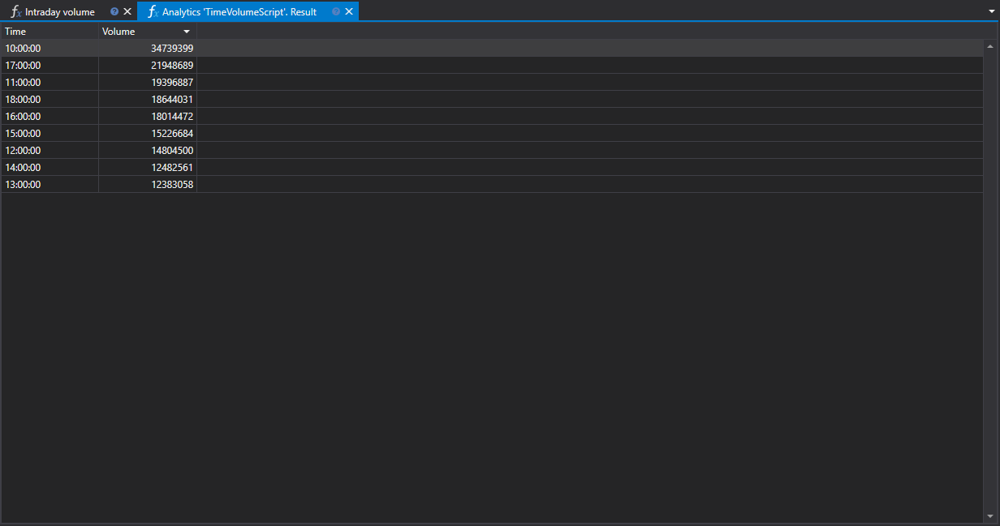

# Intraday Volume

The "Intraday Volume" script is a tool for analyzing the distribution of trading volume of securities by hours within a single trading session. Designed for use within the StockSharp platform, it targets traders and quantitative analysts aiming for an in-depth study of market behavior and trading strategy optimization.



## Functional Description

The script collects data on trading operations for a selected time period and presents it in a graph format, allowing users to visualize changes in trading volume by hour. This provides the ability to assess which hours of the day witness increased or decreased trading activity.

## Practical Significance

- **For Trading**: Understanding peak and off-peak hours helps identify the most active market periods, influencing decisions on when to enter or exit positions.
- **For Quantitative Analysis**: Quant analysts can use intraday volume data to create mathematical models and algorithms predicting market behavior based on volume indicators.

## Hourly Distribution

The distribution of trading volume by hour sheds light on market dynamics, highlighting the time intervals with the main trading activity. This may indicate changes in trends, support and resistance levels, as well as potential moments of increased liquidity or its shortage.

## Data Application

The "Intraday Volume" script can be integrated into a broader market analysis system, providing data that can be used for:

- **Strategy Adaptation**: Adjusting trading algorithm parameters according to market activity levels.
- **Risk Assessment**: Calculating the probability of significant price movements depending on the time of day.

Using the "Intraday Volume" script within the StockSharp trading platform allows traders and analysts to base their decisions on specific data regarding market activity and adapt their strategies to match current trading conditions optimally.

## Script Code

```cs
namespace StockSharp.Algo.Analytics
{
	/// <summary>
	/// The analytic script, calculating distribution of the biggest volume by hours.
	/// </summary>
	public class TimeVolumeScript : IAnalyticsScript
	{
		Task IAnalyticsScript.Run(ILogReceiver logs, IAnalyticsPanel panel, SecurityId[] securities, DateTime from, DateTime to, IStorageRegistry storage, IMarketDataDrive drive, StorageFormats format, TimeSpan timeFrame, CancellationToken cancellationToken)
		{
			if (securities.Length == 0)
			{
				logs.AddWarningLog("No instruments.");
				return Task.CompletedTask;
			}

			// script can process only 1 instrument
			var security = securities.First();

			// get candle storage
			var candleStorage = storage.GetTimeFrameCandleMessageStorage(security, timeFrame, drive, format);

			// get available dates for the specified period
			var dates = candleStorage.GetDates(from, to).ToArray();

			if (dates.Length == 0)
			{
				logs.AddWarningLog("no data");
				return Task.CompletedTask;
			}

			// grouping candles by opening time (time part only) with 1 hour truncating
			var rows = candleStorage.Load(from, to)
				.GroupBy(c => c.OpenTime.TimeOfDay.Truncate(TimeSpan.FromHours(1)))
				.ToDictionary(g => g.Key, g => g.Sum(c => c.TotalVolume));

			// put our calculations into grid
			var grid = panel.CreateGrid("Time", "Volume");

			foreach (var row in rows)
				grid.SetRow(row.Key, row.Value);

			// sorting by volume column (descending)
			grid.SetSort("Volume", false);

			return Task.CompletedTask;
		}
	}
}
```