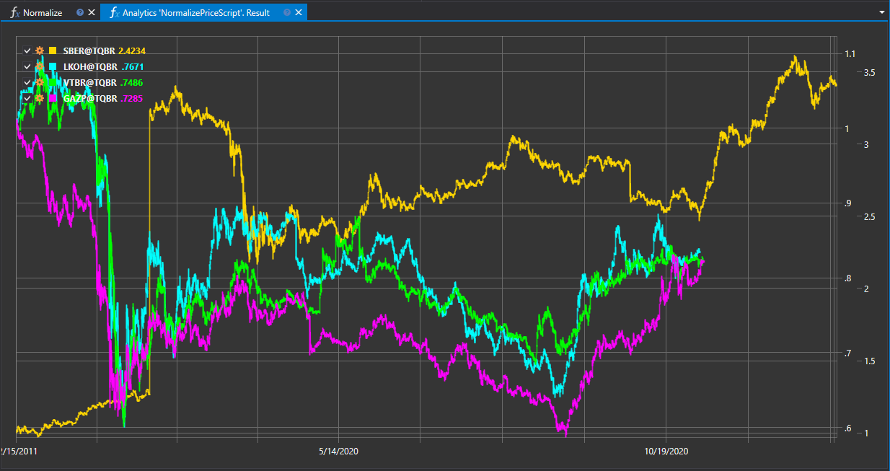

# Closing Price Normalization

The "Closing Price Normalization" script is designed to standardize the closing prices of financial instruments, enabling comparison and analysis of different assets on a unified scale. This is particularly useful when comparing instruments with varying costs and volatility.



## Script Operation Description

The script adapts closing price data by scaling or transforming them according to the selected normalization method. The result is a set of standardized values that can be used for quantitative comparison and multi-instrument analysis.

## Application of Normalization

- **Price Scale Unification**: Normalization helps bring data from various instruments to a single scale, simplifying visual comparison and analytical assessment.
- **Correlation Analysis**: Standardized data allows for the identification of correlational relationships between assets and the formation of diversified portfolios.
- **Index and Model Creation**: Normalized prices are used to create composite indices, pricing models, and other quantitative research.

## Normalization Methodology

Normalization may include the following methods:

1. **Scaling**: Adjusting closing prices to a certain range of values, such as from 0 to 1.
2. **Z-score**: Transforming closing prices using the Z-score, which indicates how many standard deviations a value deviates from the mean.
3. **Logarithmization**: Applying logarithmic transformation to smooth out data dispersion and reduce the impact of extreme values.

## Script Implementation

The normalization process typically includes the following steps:

1. **Normalization Selection**: Determining the normalization method based on the analysis goals and data characteristics.
2. **Data Processing**: Applying the chosen normalization method to the closing prices for each instrument.
3. **Results Analysis**: Using normalized data for subsequent analysis and comparison of instruments.

The "Closing Price Normalization" script is a crucial tool for preparing data for trading and quantitative analysis, allowing traders and analysts to more accurately compare and evaluate financial assets within various strategies and studies.

## Script Code on C#

```cs
namespace StockSharp.Algo.Analytics
{
	/// <summary>
	/// The analytic script, normalize securities close prices and shows on same chart.
	/// </summary>
	public class NormalizePriceScript : IAnalyticsScript
	{
		Task IAnalyticsScript.Run(ILogReceiver logs, IAnalyticsPanel panel, SecurityId[] securities, DateTime from, DateTime to, IStorageRegistry storage, IMarketDataDrive drive, StorageFormats format, TimeSpan timeFrame, CancellationToken cancellationToken)
		{
			if (securities.Length == 0)
			{
				logs.AddWarningLog("No instruments.");
				return Task.CompletedTask;
			}

			var chart = panel.CreateChart<DateTimeOffset, decimal>();

			foreach (var security in securities)
			{
				// stop calculation if user cancel script execution
				if (cancellationToken.IsCancellationRequested)
					break;

				var series = new Dictionary<DateTimeOffset, decimal>();

				// get candle storage
				var candleStorage = storage.GetTimeFrameCandleMessageStorage(security, timeFrame, drive, format);

				decimal? firstClose = null;

				foreach (var candle in candleStorage.Load(from, to))
				{
					firstClose ??= candle.ClosePrice;

					// normalize close prices by dividing on first close
					series[candle.OpenTime] = candle.ClosePrice / firstClose.Value;
				}

				// draw series on chart
				chart.Append(security.ToStringId(), series.Keys, series.Values);
			}

			return Task.CompletedTask;
		}
	}
}
```

## Script Code on Python

```python
import clr

# Add .NET references
clr.AddReference("StockSharp.Messages")
clr.AddReference("StockSharp.Algo.Analytics")
clr.AddReference("Ecng.Drawing")

from Ecng.Drawing import DrawStyles
from System import TimeSpan
from System.Threading.Tasks import Task
from StockSharp.Algo.Analytics import IAnalyticsScript
from storage_extensions import *
from candle_extensions import *
from chart_extensions import *
from indicator_extensions import *

# The analytic script, normalize securities close prices and shows on same chart.
class normalize_price_script(IAnalyticsScript):
    def Run(self, logs, panel, securities, from_date, to_date, storage, drive, format, time_frame, cancellation_token):
        if not securities:
            logs.LogWarning("No instruments.")
            return Task.CompletedTask

        chart = create_chart(panel, datetime, float)

        for security in securities:
            # stop calculation if user cancel script execution
            if cancellation_token.IsCancellationRequested:
                break

            series = {}

            # get candle storage
            candle_storage = get_tf_candle_storage(storage, security, time_frame, drive, format)

            first_close = None

            for candle in load_tf_candles(candle_storage, from_date, to_date):
                if first_close is None:
                    first_close = candle.ClosePrice

                # normalize close prices by dividing on first close
                series[candle.OpenTime] = candle.ClosePrice / first_close

            # draw series on chart
            chart.Append(to_string_id(security), list(series.keys()), list(series.values()))

        return Task.CompletedTask
```
