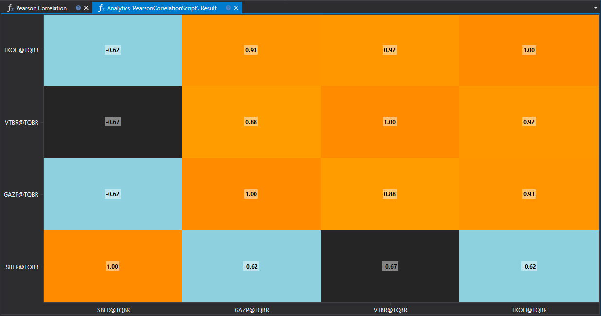

# Pearson Correlation

The Pearson correlation is a statistical method used to measure the degree of linear relationship between two quantitative variables. Within financial analysis, this method is widely utilized to explore the relationships between different assets, such as stocks or currency pairs.



## Method Description

The Pearson correlation coefficient ranges from -1 to 1, where:

- **1** indicates a perfect positive correlation,
- **0** suggests no linear relationship,
- **-1** signifies a perfect negative correlation.

The value of the coefficient shows how closely two variables are linearly related.

## Practical Application

- **Portfolio Management**: Assessing correlations between assets aids in constructing diversified portfolios to minimize risk.
- **Hedging Strategies**: Identifying assets with high negative correlation can be used to develop hedging strategies.
- **Market Trend Analysis**: Studying correlations between different markets and instruments provides insights into global economic interconnections.

## Calculating Pearson Correlation

The Pearson correlation coefficient is calculated using the following formula:

\[ r = \frac{n(\sum xy) - (\sum x)(\sum y)}{\sqrt{[n\sum x^2 - (\sum x)^2][n\sum y^2 - (\sum y)^2]}} \]

where:
- \(n\) is the number of observations,
- \(x\) and \(y\) are the values of the variables,
- \(\sum\) denotes summation.

## Script Implementation

A script for calculating Pearson correlation should include the following steps:

1. **Data Collection**: Load time series for the two variables being analyzed.
2. **Preliminary Processing**: Align time series by dates and remove missing values.
3. **Calculation**: Apply the Pearson correlation formula to the processed data.
4. **Results Analysis**: Interpret the resulting correlation coefficient for decision-making.

Calculating Pearson correlation provides crucial information for market analysis and investment strategy optimization, allowing the assessment of the degree of mutual influence between financial assets.

## Script Code on C#

```cs
namespace StockSharp.Algo.Analytics
{
	using MathNet.Numerics.Statistics;

	/// <summary>
	/// The analytic script, calculating Pearson correlation by specified securities.
	/// </summary>
	public class PearsonCorrelationScript : IAnalyticsScript
	{
		Task IAnalyticsScript.Run(ILogReceiver logs, IAnalyticsPanel panel, SecurityId[] securities, DateTime from, DateTime to, IStorageRegistry storage, IMarketDataDrive drive, StorageFormats format, TimeSpan timeFrame, CancellationToken cancellationToken)
		{
			if (securities.Length == 0)
			{
				logs.AddWarningLog("No instruments.");
				return Task.CompletedTask;
			}

			var closes = new List<double[]>();

			foreach (var security in securities)
			{
				// stop calculation if user cancel script execution
				if (cancellationToken.IsCancellationRequested)
					break;

				// get candle storage
				var candleStorage = storage.GetTimeFrameCandleMessageStorage(security, timeFrame, drive, format);

				// get closing prices
				var prices = candleStorage.Load(from, to).Select(c => (double)c.ClosePrice).ToArray();

				if (prices.Length == 0)
				{
					logs.AddWarningLog("No data for {0}", security);
					return Task.CompletedTask;
				}

				closes.Add(prices);
			}

			// all array must be same length, so truncate longer
			var min = closes.Select(arr => arr.Length).Min();

			for (var i = 0; i < closes.Count; i++)
			{
				var arr = closes[i];

				if (arr.Length > min)
					closes[i] = arr.Take(min).ToArray();
			}

			// calculating correlation
			var matrix = Correlation.PearsonMatrix(closes);

			// displaying result into heatmap
			var ids = securities.Select(s => s.ToStringId());
			panel.DrawHeatmap(ids, ids, matrix.ToArray());

			return Task.CompletedTask;
		}
	}
}
```

## Script Code on Python

```python
import clr

# Add .NET references
clr.AddReference("StockSharp.Messages")
clr.AddReference("StockSharp.Algo.Analytics")
clr.AddReference("Ecng.Drawing")

from Ecng.Drawing import DrawStyles
from System import TimeSpan
from System.Threading.Tasks import Task
from StockSharp.Algo.Analytics import IAnalyticsScript
from storage_extensions import *
from candle_extensions import *
from chart_extensions import *
from indicator_extensions import *
from numpy_extensions import nx

clr.AddReference("NumpyDotNet")
from NumpyDotNet import np

# The analytic script, calculating Pearson correlation by specified securities.
class pearson_correlation_script(IAnalyticsScript):
    def Run(
        self,
        logs,
        panel,
        securities,
        from_date,
        to_date,
        storage,
        drive,
        format,
        time_frame,
        cancellation_token
    ):
        if not securities:
            logs.LogWarning("No instruments.")
            return Task.CompletedTask

        closes = []

        for security in securities:
            # stop calculation if user cancel script execution
            if cancellation_token.IsCancellationRequested:
                break

            # get candle storage
            candle_storage = get_tf_candle_storage(storage, security, time_frame, drive, format)

            # get closing prices
            prices = [float(c.ClosePrice) for c in load_tf_candles(candle_storage, from_date, to_date)]

            if len(prices) == 0:
                logs.LogWarning("No data for {0}", security)
                return Task.CompletedTask

            closes.append(prices)

        # all arrays must be the same length, so truncate longer ones
        min_length = min(len(arr) for arr in closes)
        closes = [arr[:min_length] for arr in closes]
        
        # convert list or array into 2D array
        array2d = nx.to2darray(closes)
        
        # calculating correlation using NumSharp
        np_array = np.array(array2d)
        matrix = np.corrcoef(np_array)

        # displaying result into heatmap
        ids = [to_string_id(s) for s in securities]
        panel.DrawHeatmap(ids, ids, nx.tosystemarray(matrix))

        return Task.CompletedTask
```
