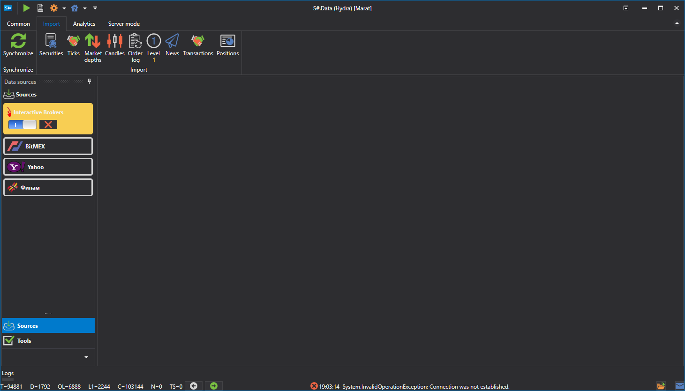

# Importing

[Hydra](../hydra.md) allows you to import your own data saved in the .csv format. To import, open the **Import** tab, and select the type of exchange data that you want to import.

The following types can be imported: 

- [Candles](importing/candles.md)
- [Securities](importing/instruments.md)
- [Trades](importing/ticks.md)
- [Order books](importing/order_books.md)
- [Order log](importing/order_log.md)
- [Level 1](importing/level_1.md)
- [News](importing/news.md)
- [Own transactions](importing/transactions.md)

**Watch [video tutorial](videos/import_task.md)**
