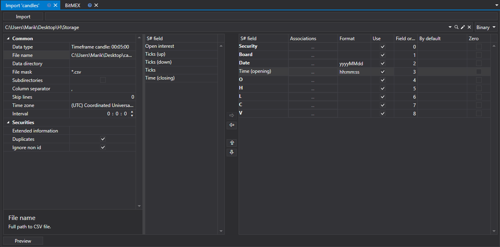
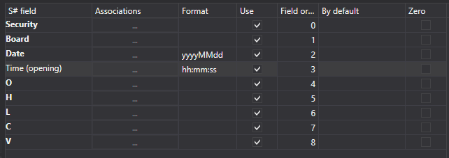
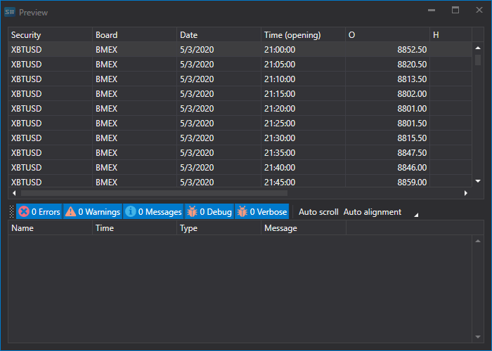

# Candles

To import candles, select **Import \=\> Candles** item from the main application menu.



## Candle import process

1. **Common.**.
   - **Data type** \- type of imported data.
   - **Filename** \- full path to the CSV file.
   - **Data directory** \- folder where the final [S\#](../../api.md) files will be saved .
   - **File mask** \- file mask that is used when scanning the directory. For example, candle \_\*.csv.
   - **Column separator** \- column separator. Tabulation is denoted by TAB.
   - **Indent from the beginning** \- number of lines from the beginning of file to be skipped (if they contain meta information).
   - **Time zone** \- time zone.
   - **Interval** \- frequency of data update.

   **Instruments**
   - **Extended information** \- save extended imported fields in the extended information storage
   - **Duplicates** \- whether duplicate securities will be updated if they already exist.
2. Configure import parameters for [S\#](../../api.md) fields.
   - **S\# field** \- value of the S\# field. ( **Security, Board**, etc.).
   - **Associations** \- match the column value in file to the stocksharp type (if necessary).
   - **Format** \- data format. Typically used when importing date and time values (see [Trades](ticks.md)).
   - **Use** \- whether to use the data when importing.
   - **Field order** \- sequence in which the property columns of the imported item are arranged.

     For example, if the imported file has the following template type: 

     ```none
     {SecurityId.SecurityCode},{SecurityId.BoardCode},{OpenTime:yyyyMMdd},{OpenTime:default:HH:mm:ss},{OpenPrice},{HighPrice},{LowPrice},{ClosePrice},{TotalVolume}
     	  				
     ```

     Then the following setting will correspond to it:

     Here:

     The **Security** value corresponds to the **{SecurityId.SecurityCode}** with the serial number **0**. 

     > [!TIP]
     > In programming, the ordinal number of the first element is always 0

     The **Board** value corresponds to the **{SecurityId.BoardCode}** with serial number **1**. And so on. 
   - **By default** \- default field value. For example, it can be used for repeated field values (Security, **or Board** when importing trades, order books, etc., see [Trades](ticks.md)), if the corresponding information is not in the data file.
   - **Zero** \- in some cases when saving data, some data properties may be saved as "0", which is an error. For example, the price value, for various reasons, can be equal to 0, which is not acceptable, and in the future will lead to an incorrect reading. This can lead to incorrect strategy operation that work with them and, as a consequence, an erroneous result. By checking the box, the user specifies that data in this section, if equal to 0, is written as empty, that is, it is absent. During further work, for example, testing, the user will see an error of no data, which will indicate an incorrect data import. In fact, this is the protection of user from "broken" data, for more correct work. 

   The user can configure a large number of properties for the downloaded data. Based on the imported file template, you need to specify the property and assign it the required number in the sequence.
3. To preview the data, click the **Preview** button.
4. Click the **Import** button..
