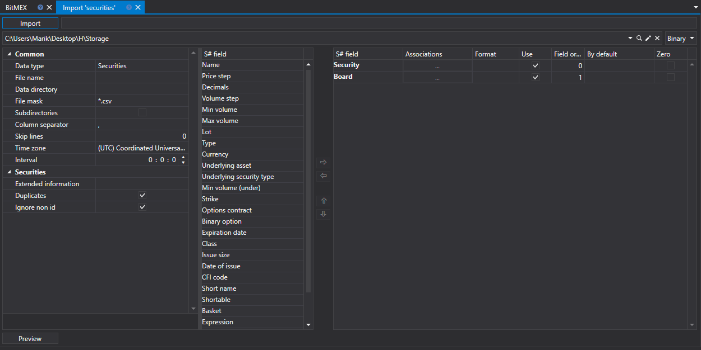
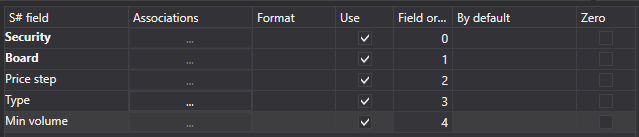
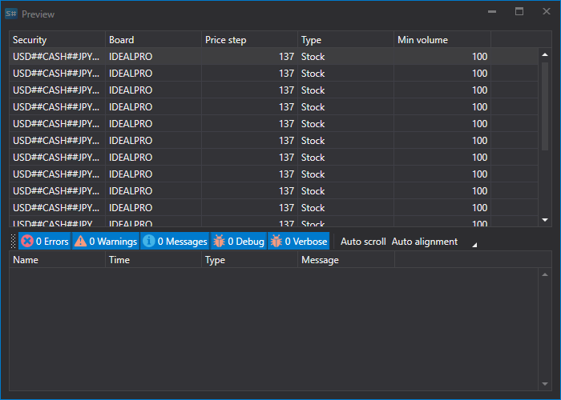

# Instruments

To import instruments, select the **Import \=\> Instruments** tab.



## Import process.

1. **Import settings.**.

   See [Candles](candles.md) import.
2. Configure import parameters for [S\#](../../api.md) fields.

   See [Candles](candles.md) import.

   **Let's consider an example of importing an security from a CSV file:**
   - The file from which you want to import data has the following template:

     ```none
     {SecurityId.SecurityCode};{SecurityId.BoardCode};{PriceStep};{SecurityType};{VolumeStep}
     	  				
     ```

     Here the values of {SecurityId.SecurityCode} and {SecurityId.BoardCode} correspond to the values of **Security** and **Board**, respectively. Therefore, in the **Field order** field we assign the values 0 and 1, respectively.
   - For the {PriceStep} field, select the **Nominal** field from the **S\# field** window and assign it the value 2.
   - For the {SecurityType} field, select the **Type** field from the **S\# field** window \- the security type (stock, currency, futures, etc.). We assign it the value 3.
   - For the {VolumeStep} field, select the **Min volume (base)** field from the **S\# field** window \- the base or minimum security volume. We assign it the value 4
   - The field setting window will look like this:

   The user can configure a large number of properties for the downloaded data. Based on the imported file template, you need to specify the property and assign it the required number in the sequence.
3. To preview the data, click the **Preview** button.
4. Click the **Import** button.
