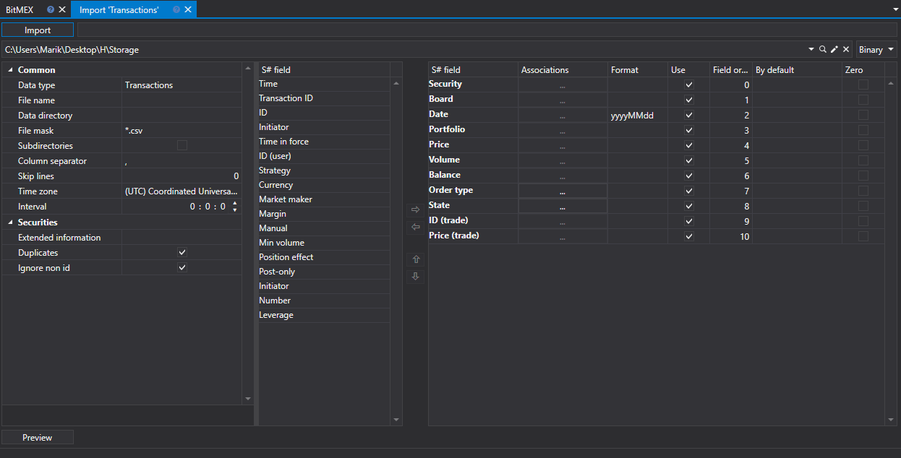

# Transactions

To import your transactions, you need to select **Import \=\> Own Transactions** from the main application menu.

## The process of importing your transactions

1. Execute **CSV Import Settings**.

   See [Candles](candles.md) import.
2. Configure import parameters for [S\#](../../api.md) fields.

   See [Candles](candles.md) import.
3. To preview the data, click the **Preview** button
4. Click the **Import** button.
