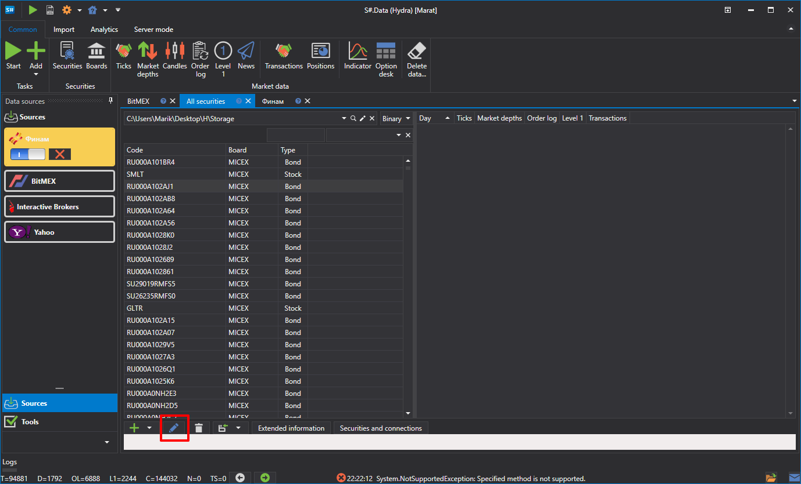
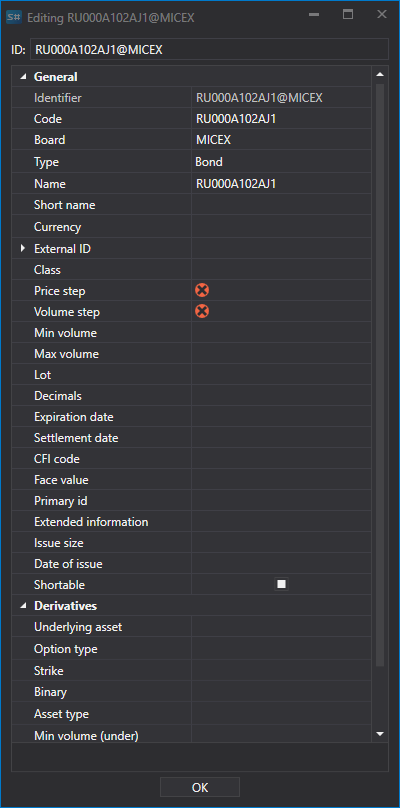
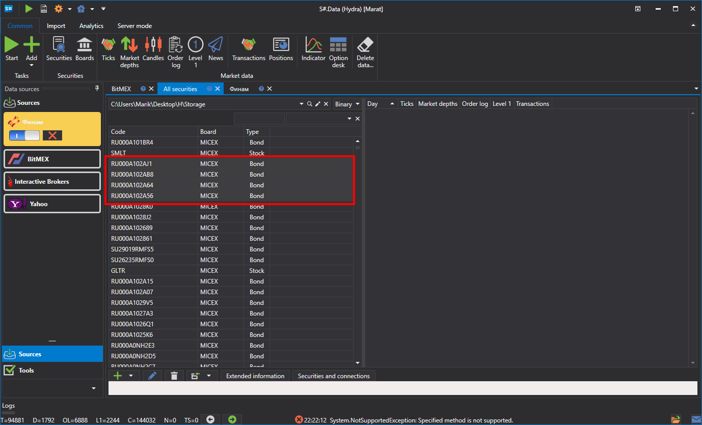

# Editing instruments

To edit an instrument (for example, if it was created without all required data), double-click the instrument or click the  button to open the window where you can make the necessary changes:

Go to the **Securities** window.

The editing window will open.

If necessary, you can edit the instrument group. Select an instrument group and click the  button.

Then edit the group as needed.

If all selected instruments have the same value in a field, that value will be displayed. If the values differ, the field will be empty. For example, if two instruments have a Price Step of 1 but one has a lot size of 10 and the other 100, the Price Step field will show 1, and the Volume Step field will be empty.
