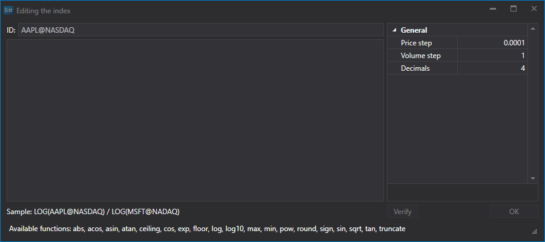
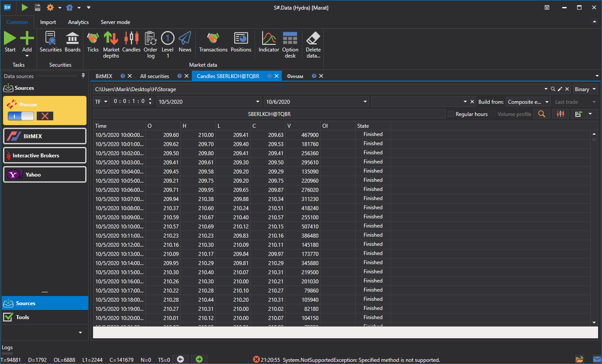

# Index

With [Hydra](../../hydra.md), you can create your own index.

On the **Common** tab select **Securities** so that the **All Securities** tab appears.

Before creating the **Index**, check which market data is available. Select the path where the data is stored and sequentially view the instruments that should participate in the calculation of the index. If there are gaps, download the necessary market data (for example, from Finam).

As an example, we will consider the instrument ratio index AAPL@NYSE\/GOOG@NYSE.

The first step is to create the **Index**. Click the **Create security\=\>Index** button on the **All Securities** tab, after which the following window will appear:

To create the **Index** instrument, you must specify a name and add the mathematical formula of a combination of several instruments. Together with the standard mathematical operators, you can use the following functions:

- **abs(a)** \- Returns the absolute value of a number.
- **acos(a)** \- Returns the angle whose cosine is equal to the specified number.
- **asin(a)** \- Returns the angle whose sine is equal to the specified number.
- **atan(a)** \- Returns the angle whose tangent is equal to the specified number.
- **ceiling(a)** \- Returns the smallest integer that is greater than or equal to a specified number.
- **cos(a)** \- Returns the cosine of the specified angle.
- **exp(a)** \- Returns the value of e raised to the specified degree.
- **floor(a)** \- Returns the largest integer that is less than or equal to the specified number.
- **log(a)** \- Returns the natural logarithm (with base e) of the specified number.
- **log10(a)** \- Returns the logarithm with base 10 of the specified number.
- **max (a, b)** \- Returns the larger of two decimal numbers.
- **min(a, b)** \- Returns the smaller of two decimal numbers.
- **pow(a, b)** \- Returns the specified number raised to the specified power.
- **sign(a)** \- Returns an integer indicating the sign of the specified number.
- **sin(a)** \- Returns the sine of the specified angle.
- **sqrt (a)** \- Returns the square root of the specified number.
- **tan(a)** \- Returns the tangent of the specified angle.
- **truncate(a)** \- Calculates the integer part of the specified number.

Next, click the [Candles](../working_with_data/view_and_export/candles.md) button on the **Common** tab, select the created **Index** instrument and the data period, set **Composite Element** in the **Create From:** field, and then press the  button.

The generated data can be exported to Excel, XML or TXT formats. Export is done using the drop-down list.

